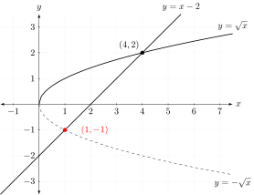

# Harlinn.Math /Math.h Overview

The header, `Harlinn/Math/Math.h`, provides alternatives to many of the core mathematical function that is specified in the C and C++ standards. All of the functions can be `constexpr` evaluated, and several offer runtime performance benefits as well.

`Harlinn/Math/Math.h` is header only. Just add `$(HCC_HOME)\Harlinn.Common\include` and `$(HCC_HOME)\Harlinn.Math\include` to the the `Additional Include Directories` path collection on the `C/C++`/`General` page of your project.

### Concepts

- [Concepts](Concepts.md)

### Functions

- [Basic operations](BasicOperations.md)
- [Exponential functions](ExponentialFunctions.md)
- [Power and root finding fonctions](PowerFunctions.md)
- [Trigonometric functions](TrigonometricFunctions.md)
- [Hyperbolic functions](HyperbolicFunctions.md)
- [Error and gamma functions](ErrorAndGammaFunctions.md)
- [Nearest integer floating point operations](NearestIntegerFloatingPointOperations.md)
- [Floating point manipulation functions](FloatingPointManipulationFunctions.md)
- [Classification and comparison](ClassificationAndComparison.md)
- [Other functions](OtherFunctions.md)
- [Special Functions](SpecialFunctions.md)
- [Probability and statistics](ProbabilityAndStatistics.md)
- [Compensated arithmetic](CompensatedArithmetic.md)

## Background 

The functions were created to explore `constexpr` evaluation of mathematical expressions with Visual C++.
Constexpr, introduced in C++11 and further enhanced in subsequent versions, allows developers 
to perform computations at compile time. This means less runtime overhead, optimized code, 
and a significant boost in execution speed.

Since `constexpr` evaluation doesn't allow undefined behavior, this can be used to improve the
safety of C++ code by performing `constexpr` evaluation of code in unit tests. 
The `constexpr` evaluated code will not compile until all code with undefined behavior is 
eliminated from the execution path of the `constexpr` evaluated code. 

While C++ 26 will enable `constexpr` evaluation of many of the functions within `<cmath>`, 
`Harlinn/Math/Math.h` makes this possible right now.

Much of the code is based on version `0.8.5` of the [OpenLibm](https://github.com/JuliaMath/openlibm) 
mathematical C library used by the [Julia](https://julialang.org/) programming language.

The functions return NaN and +/- infinity as expected, but does not always set the exception flags
in the floating point environment. The reason for this is that the code that generated the floating
point exceptions in [OpenLibm](https://github.com/JuliaMath/openlibm) prevented full compile time constant evaluation.

The API is template based, which may seem odd, but this helps to reduce the number of
unintended conversions between numeric types. Most functions designed to work with 
floating point values do not accept integer values without an explicit cast to
`float` or `double`.  

### Unit Tests

Unit tests for `constexpr` evaluation of the core functions from `Harlinn/Math/Math.h` are provided in 
[ConstexprMathTests.cpp](https://github.com/Harlinn/Harlinn.Windows/blob/master/Tests/Harlinn.Common.Core.Math.Tests/ConstexprMathTests.cpp).

[Harlinn.Common.Core.Math.Tests](https://github.com/Harlinn/Harlinn.Windows/tree/master/Tests/Harlinn.Common.Core.Math.Tests) contains 678 test cases, 
striving to demonstrate the accuracy of the computations. Be aware that running the release build of the full test suite takes nearly an hour,
as several of the tests seeks to determine the result for every possible input, or very large subsets of the possible inputs - comparing
the results with those produced by the standard implementation.

### Benchmarks

The performance of the functions is benchmarked using the [Google benchmark](https://github.com/google/benchmark) library, 
and can be verified by building and executing [BasicMathBenchmarks](https://github.com/Harlinn/Harlinn.Windows/tree/master/Benchmarks/Math/BasicMathBenchmarks) 
included in the [Harlinn.Windows solution](/Cpp/Harlinn.Windows/Harlinn.Windows.html).

See [Benchmarks](Benchmarks.html) for the benchmark results.

### PBRTO a micro optimized raytracing app 

Benchmarks for individual functions cannot always be relied upon to accurately determine how well they 
will perform perform in a real application. Benchmarks provides a good idea about 
how the functions will perform, but when the compiler, and linker, employs global optimizations across all
the compilation units, there are often a few surprises. PBRTO was created as a tool to help 
uncovering these surprises.

PBRTO is a micro optimized version of [PBRT-v4](https://github.com/mmp/pbrt-v4), under development 
as an example of how the functionality in `Harlinn/Math/Math.h`, `Harlinn/Math/Simd.h` and `Harlinn/Math/VectorMath.h` can be used to 
optimize the performance of real, computationally intensive, apps. It's now about `91` % 
faster than the release build of the original PBRT. [more...](pbrto.html)

### Implementation quality   

The quality of the implementation is, since it is based on [OpenLibm](https://github.com/JuliaMath/openlibm),
high. [OpenLibm](https://github.com/JuliaMath/openlibm) does many things very well, but sometimes
the Visual C++ runtime, an intrinsic function, or another alternative implemented by the library, perform 
better. When this is the case, the library selects the implementation with the best runtime performance.

Since some functions are implemented differently for `constexpr` evaluation, they will not always return
identical results when executed at runtime. The difference is small; and can, in most cases, be ignored,
as in these cases both implementations are based on approximations.

Probability and statistics

Formatting and helpers

- [Formatters are defined inline for `Interval<T>` in the header] � see `std::formatter` specializations for `Interval<float>` and `Interval<double>` in the header.

Miscellaneous utilities

- [FRExp.md](./FRExp.md) / [ModF.md](./ModF.md)
- [ScaleBN.md](./ScaleBN.md) � scaling by powers of the radix.
- [Half.md not present as a separate doc] � `Half` 16-bit float type implemented in header.

Alphabetical list of classes and functions:

- [Abs](Abs.md)
- [ACos](ACos.md)
- [ACosH](ACosH.md)
- [AddAdjustDown](AddAdjustDown.md)
- [AddAdjustUp](AddAdjustUp.md)
- [ASin](ASin.md)
- [ASinH](ASinH.md)
- [ATan](ATan.md)
- [ATan2](ATan2.md)
- [ATanH](ATanH.md)
- [Cbrt](Cbrt.md)
- [Ceil](Ceil.md)
- [Clamp](Clamp.md)
- [CompensatedFloat](CompensatedFloat.md)
- [CompensatedSum](CompensatedSum.md)
- [CopySign](CopySign.md)
- [Cos](Cos.md)
- [CosH](CosH.md)
- [Deg2Rad](Deg2Rad.md)
- [Degrees](Degrees.md)
- [DifferenceOfProducts](DifferenceOfProducts.md)
- [DivAdjustDown](DivAdjustDown.md)
- [DivAdjustUp](DivAdjustUp.md)
- [Erf](Erf.md)
- [ErfC](ErfC.md)
- [EvaluatePolynomial](EvaluatePolynomial.md)
- [Exp](Exp.md)
- [Exp10](Exp10.md)
- [Exp2](Exp2.md)
- [ExpM1](ExpM1.md)
- [FastAbs](FastAbs.md)
- [FastExp](FastExp.md)
- [FastLog2](FastLog2.md)
- [FastPow](FastPow.md)
- [FDim](FDim.md)
- [FindInterval](FindInterval.md)
- [Floor](Floor.md)
- [FMA](FMA.md)
- [FMAAdjustDown](FMAAdjustDown.md)
- [FMAAdjustUp](FMAAdjustUp.md)
- [FMod](FMod.md)
- [FRExp](FRExp.md)
- [Gamma](Gamma.md)
- [Gaussian](Gaussian.md)
- [GaussianIntegral](GaussianIntegral.md)
- [Hypot](Hypot.md)
- [ILogB](ILogB.md)
- [InnerProduct](InnerProduct.md)
- [Interval](Interval.md)
- [IsFinite](IsFinite.md)
- [IsInf](IsInf.md)
- [IsNaN](IsNaN.md)
- [IsNormal](IsNormal.md)
- [IsPowerOf4](IsPowerOf4.md)
- [IsSameValue](IsSameValue.md)
- [IsZero](IsZero.md)
- [J0](J0.md)
- [J1](J1.md)
- [JN](JN.md)
- [Lerp](Lerp.md)
- [LGamma](LGamma.md)
- [Log](Log.md)
- [Log10](Log10.md)
- [Log1P](Log1P.md)
- [Log2](Log2.md)
- [Log2Int](Log2Int.md)
- [LogB](LogB.md)
- [Logistic](Logistic.md)
- [LogisticCDF](LogisticCDF.md)
- [Max](Max.md)
- [Min](Min.md)
- [Mod](Mod.md)
- [ModF](ModF.md)
- [MulAdjustDown](MulAdjustDown.md)
- [MulAdjustUp](MulAdjustUp.md)
- [Multiply](Multiply.md)
- [NewtonBisection](NewtonBisection.md)
- [NextAfter](NextAfter.md)
- [NextDown](NextDown.md)
- [NextFloatDown](NextFloatDown.md)
- [NextFloatUp](NextFloatUp.md)
- [NextUp](NextUp.md)
- [Pow](Pow.md)
- [Quadratic](Quadratic.md)
- [Rad2Deg](Rad2Deg.md)
- [Radians](Radians.md)
- [ReciprocalSqrt](ReciprocalSqrt.md)
- [Remainder](Remainder.md)
- [RemQuo](RemQuo.md)
- [Round](Round.md)
- [RoundUpPow2](RoundUpPow2.md)
- [RoundUpPow4](RoundUpPow4.md)
- [SafeACos](SafeACos.md)
- [SafeASin](SafeASin.md)
- [SafeSqrt](SafeSqrt.md)
- [ScaleBN](ScaleBN.md)
- [SignBit](SignBit.md)
- [signum](signum.md)
- [Sin](Sin.md)
- [Sinc](Sinc.md)

Usage guidance (short)

- For tight bounds: compute a compensated quantity (e.g. `TwoProd`) and convert with `Interval<T>::FromValueAndError(v, err)`.

- For decisions: test interval endpoints (e.g. `if (discrim.LowerBound() >= 0)`) rather than midpoints when correctness matters.

- For performance: prefer `FMA` and `std::fma` where available; directed-adjust helpers are cheap (one `NextUp`/`NextDown`) and help make code robust.

Examples

See `Interval.md` and `TwoProd.md` for copy-paste examples converting compensated products to intervals and accumulating them safely.

License

See the header for licensing and copyright information.
