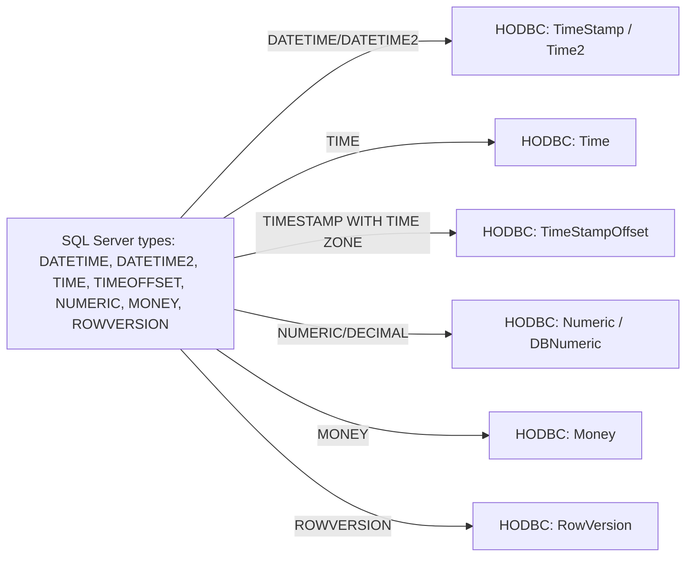
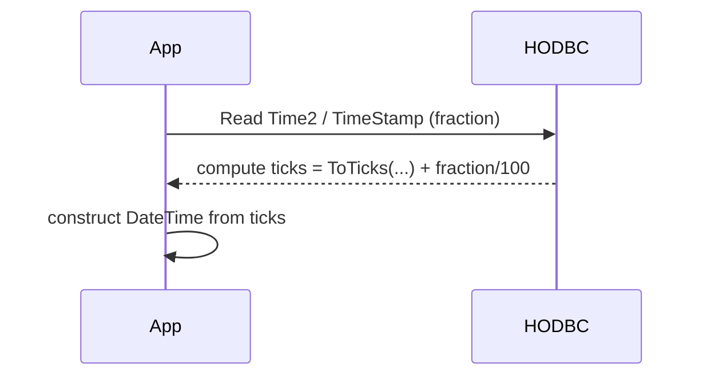

# Chapter 9 — Date, Time and Numeric Types (Development Plan)

Goal
- Produce a focused chapter that documents the `HODBC.h` date/time and numeric types, explains their mapping to SQL Server types, shows typical usage patterns (binding, retrieval, conversion), and supplies examples and exercises that demonstrate correct handling of precision, scale and fractional time values.

Learning outcomes
- Understand the C++ wrappers provided in `HODBC.h` for date/time and numeric types (e.g., `TimeStamp`, `Date`, `Time`, `Time2`, `TimeStampOffset`, `Numeric`, `Money`, `RowVersion` and their `DB*` aliases).
- Map between SQL Server types and the wrapper types and choose appropriate `SqlType`/`NativeType` when binding.
- Correctly handle fractional seconds, precision/scale for `NUMERIC`/`DECIMAL`, and fixed 8-byte row versions.
- Implement reliable conversions between wrapper types and `Harlinn::Common::Core::DateTime` / `TimeSpan` and handle NULL semantics using `DBValue<T>`.

Target audience and prerequisites
- Readers who completed earlier chapters (Introduction, ODBC primer, statements, binding, retrieving results).
- Familiarity with `HODBC.h` DB-aware containers (`DBValue<T>`, `FixedDB*`) and with the repo's C++23 coding rules.

Chapter outline (sections and content)

1. Overview and motivation
   - Why proper date/time and numeric handling matters (precision, interoperability, daylight/timezone concerns when using offsets).

2. Types introduced by `HODBC.h` (quick API tour)
   - `TimeStamp` (alias `DBTimeStamp`), `Date` (`DBDate`), `Time` (`DBTime`), `Time2` (`DBTime2`), `TimeStampOffset` (`DBTimeStampOffset`), `Numeric` / `DBNumeric` / `DBDecimal`, `Money` / `DBMoney`, `RowVersion` / `DBRowVersion`.
   - One-line purpose and typical SQL Server mapping (e.g., `Time2` ? `SQL_SS_TIME2`, `TimeStampOffset` ? `SQL_SS_TIMESTAMPOFFSET`).

3. Fractional seconds and conversion formulas (MathJax)
   - `TimeStamp` and `Time2` store a `fraction` field. Conversion to ticks used in `HODBC.h` is implemented as:

   $$\text{ticks} = \text{DateTime::ToTicks(year,month,day,hour,minute,second)} + \frac{\text{fraction}}{100}$$

   - Explain the origin of the `fraction / 100` factor (ODBC/MS SQL stores fraction in 100-nanosecond units or driver-specific unit that HODBC converts to DateTime ticks) and show the reverse assignment used in `operator=`.

4. Date and time wrappers usage
   - `Date` converts to/from `DateTime` by packing/unpacking year, month, day.
   - `Time` and `Time2` convert to/from `DateTime`/`TimeSpan` and preserve fractional precision for `Time2`.
   - `TimeStampOffset` includes timezone hour/minute fields — demonstrate reading and converting to UTC or preserving offsets.

5. Numeric / Decimal handling and precision/scale
   - `SQL_NUMERIC_STRUCT` is wrapped by `Numeric` in `HODBC.h`. Explain the fields (precision, scale, sign, and value bytes) and how to choose column metadata for binding.
   - MathJax: represent decimal value reconstruction from scaled integer and scale s:

   $$\text{value} = \dfrac{\text{unscaledInteger}}{10^{s}}$$

   - Show example: storing 123456 with scale 2 represents 1234.56.
   - Recommend using `DBNumeric`/`DBDecimal` as `DBValue<Numeric>` and provide guidance on buffer sizes and `SQL_C_NUMERIC`/`SQL_NUMERIC_STRUCT` binding.

6. Money and fixed-point types
   - `Money` struct in `HODBC.h` (two-part 64-bit value) mapping to SQL Server `money`/`smallmoney`. Show conversion example and precision caveats.

7. RowVersion / `timestamp`
   - `RowVersion` is an 8-byte binary used for optimistic concurrency. Explain `DBRowVersion` wrapper and equality semantics implemented in `HODBC.h`.

8. Binding and retrieval examples
   - Example patterns to bind and retrieve each type using `DBValue<T>` and `BindParameter` / `BindColumn` helpers.
   - Show null handling using `DBValue::Indicator()` and `IsNull()`.

9. Timezone, offsets and best practices
   - Recommend storing UTC where possible; if using `TimeStampOffset`, preserve offset or convert to UTC at application boundary.
   - Warn about daylight savings and timezone conversions outside DB layer.

10. Examples and exercises
    - Example A: Insert and retrieve `TimeStamp` with fractional seconds, validating fractional precision.
    - Example B: Work with `Time2(7)` precision and verify round-trip accuracy.
    - Example C: Store and read `NUMERIC(18,4)` values using `DBNumeric`, validate reconstruction with formula.
    - Exercise: Build a small test that inserts a row with `rowversion` and demonstrates optimistic-update logic (compare `DBRowVersion`).

11. Deliverables and artifact locations
    - Chapter markdown: `Harlinn.ODBC\Documentation\Chapters\09_DateTimeAndNumericTypes.md` (final chapter).
    - Examples: `Examples\ODBC\DocsExamples\DateTimeNumeric\` with files:
      - `TimeStampPrecision.cpp` (TimeStamp / Time2 round-trip)
      - `NumericDecimalExample.cpp` (Numeric/Decimal binding)
      - `RowVersionExample.cpp` (rowversion concurrency demo)
    - README in examples folder with test schema and `HODBC_TEST_CONN` gating.

12. Implementation tasks (step-by-step)
1. Draft chapter markdown at `Chapters\09_DateTimeAndNumericTypes.md`, include MathJax formulas and Mermaid diagrams.
2. Implement three example programs in `Examples\ODBC\DocsExamples\DateTimeNumeric` demonstrating binding and round-trip verification.
3. Build and run examples on MSVC x64 (C++23) using `HODBC_TEST_CONN` env var; gate integration tests.
4. Add unit/integration tests (Boost.Test) under `Tests\Harlinn.ODBC.Tests` gated by `HODBC_TEST_CONN`.
5. Peer review, polish text and code, run formatting/linting (`clang-format`/`clang-tidy`), and link chapter from `Documentation\Readme.md`.

13. Acceptance criteria
- Chapter file exists and is linked from TOC.
- Examples compile and run (with a provided connection) and verify fractional seconds and numeric reconstruction.
- Chapter documents conversion formulas, precision/scale handling and timezone recommendations.
- Code and documentation follow repo rules: C++23, XML doc for public snippets, naming conventions, formatting and tests using Boost.Test.

Mermaid diagrams (embed in chapter)

Type mapping overview

Conversion flow for fraction -> ticks

Estimated effort
- Draft chapter: 3–5 hours.
- Implement examples + tests: 2–4 hours (DB availability dependent).
- Review & polish: 1–2 hours.
- Total: ~6–11 hours.

Notes / references
- Use types and helpers observed in `Harlinn.ODBC\HODBC.h` (e.g., `TimeStamp::ToDateTime`, `Time2::ToDateTime`, `DBNumeric`, `DBMoney`, `DBRowVersion`).
- Follow project style: C++23, PascalCase types, camelCase parameters, private fields ending with underscore, XML-style public documentation, and Boost.Test for tests.

If you want I can now create the chapter draft and example files under the suggested examples folder.