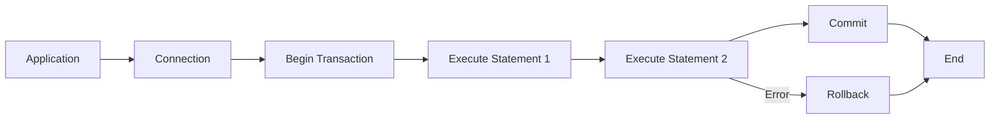
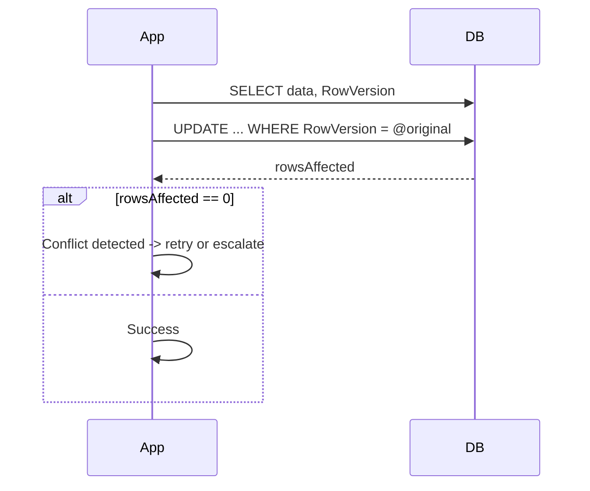
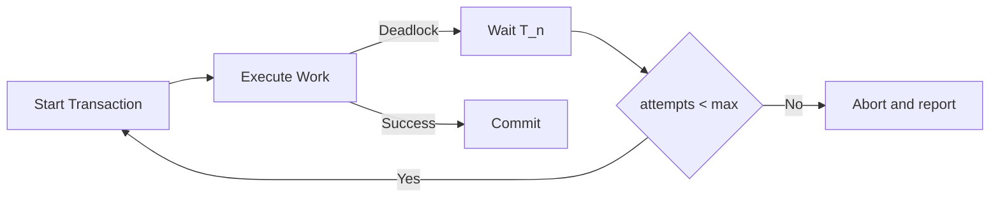

# Chapter 10 — Transactions and Concurrency (Development Plan)

Goal
- Produce a focused, practical chapter that explains transaction control and concurrency strategies when using `HODBC.h` with Microsoft SQL Server. Cover autocommit vs explicit transactions, isolation levels, optimistic vs pessimistic concurrency, savepoints, use of `RowVersion`, and patterns for robust error handling and retries.

Learning outcomes
- Understand autocommit semantics and how to use explicit transactions (`Commit`, `Rollback`) via `HODBC` wrappers.
- Configure and choose isolation levels appropriate to application needs (consistency vs concurrency vs performance) and understand side effects (blocking, phantom reads, non-repeatable reads).
- Implement optimistic concurrency using `rowversion`/`DBRowVersion` and pessimistic concurrency using appropriate locking strategies.
- Use savepoints for partial rollbacks and implement retry/backoff strategies for transient deadlocks and serialization errors.
- Apply best practices for transaction length, batching, and connection/transaction pooling interactions.

Target audience and prerequisites
- Readers who completed prior chapters (Environment/Connection, Statement, Binding, Retrieving Results) and understand basic SQL Server behavior and `HODBC.h` primitives.
- Requires a test SQL Server instance for integration examples.

Chapter outline (sections and brief contents)

1. Introduction — why transactions matter
   - ACID properties and practical implications for application code. Short elevator pitch and examples of common bugs from poor transaction handling.

2. Autocommit vs explicit transactions
   - Explain autocommit default behavior and how `Connection` controls autocommit attribute.
   - Show code snippets using `Connection` methods (set autocommit off/on) and explicit `Commit` / `Rollback` via `TransactionCompletionType` or connection helpers.

3. Isolation levels and effects
   - Describe isolation levels (Read Uncommitted, Read Committed, Repeatable Read, Serializable, Snapshot) and map to SQL Server behavior.
   - Explain consequences: phantom reads, non-repeatable reads, dirty reads, blocking and deadlocks.
   - Show recommended defaults and when to escalate isolation.

4. Pessimistic vs optimistic concurrency
   - Pessimistic: acquiring locks (SELECT ... WITH (XLOCK) or using appropriate isolation level). Discuss drawbacks (blocking) and when to use.
   - Optimistic: using `rowversion`/`timestamp` columns and `DBRowVersion` to detect concurrent updates. Example pattern: read, modify, update WHERE RowVersion = @originalRowVersion, detect zero-rows-affected and retry or surface conflict.

5. Savepoints and partial rollbacks
   - Using SQL-level savepoints (`SAVE TRANSACTION`) and `ROLLBACK TO SAVEPOINT` patterns. Show example using `Statement::Execute` for savepoint SQL and `Rollback` semantics.

6. Deadlocks, retries and backoff strategies
   - Detecting deadlocks (SQLSTATE or SqlState diagnostics) and common error codes (e.g., deadlock victim). Implement exponential backoff retry logic.
   - MathJax: simple backoff schedule formula for retry interval $T_n$ with base $T_0$ and factor $r$:

   $$T_n = T_0 \times r^{n}$$

   - Recommend max attempts and jitter strategies.

7. Transaction sizing and batching
   - Best practices: keep transactions short, avoid user interaction inside transactions, batch large writes to balance atomicity and throughput.
   - Throughput heuristic: with average transaction latency $t_{avg}$ (seconds) and concurrency $C$ (parallel transactions), estimated max throughput $R$ (transactions/second):

   $$R \approx \dfrac{C}{t_{avg}}$$

   - Use this to reason about pool sizing and concurrency.

8. Interaction with connection pooling
   - Explain how connection pooling (Chapter 4) affects transaction scope: ensure connections returned to pool have deterministic transaction state (commit or rollback) to avoid leaking uncommitted transactions to other borrowers.
   - Demonstrate using RAII patterns to always `Commit` or `Rollback` before releasing connection.

9. Using `DBRowVersion` and `RowVersion` wrapper in `HODBC.h`
   - Show code example using `DBRowVersion` for optimistic concurrency: reading rowversion, including it in WHERE clause for update, detecting conflicts via affected-row count.

10. Examples and walkthroughs
    - Example A: explicit transaction for multi-statement update with commit/rollback and error handling.
    - Example B: optimistic concurrency with `rowversion` demonstrating read-modify-update and conflict detection + retry.
    - Example C: savepoint example showing partial rollback within a transaction.
    - Example D: deadlock detection and exponential backoff retry wrapper.

11. Exercises
    - Exercise 1: Implement optimistic concurrency for a `Users` table using `rowversion` and demonstrate conflict resolution.
    - Exercise 2: Implement a retry wrapper that retries transactions on deadlock for up to N attempts with exponential backoff and jitter.
    - Exercise 3: Measure throughput vs transaction size by varying the number of statements in a transaction and plotting results.

12. Deliverables & artifact locations
    - Chapter markdown: `Harlinn.ODBC\Documentation\Chapters\10_TransactionsAndConcurrency.md`.
    - Examples: `Examples\ODBC\DocsExamples\Transactions\` with files:
      - `ExplicitTransaction.cpp`
      - `OptimisticConcurrencyRowVersion.cpp`
      - `SavepointPartialRollback.cpp`
      - `RetryWithBackoff.cpp`
    - README for examples with schema setup and `HODBC_TEST_CONN` gating.

13. Implementation tasks (step-by-step)
    1. Draft chapter markdown with code snippets, MathJax formulas and Mermaid diagrams at `Chapters\10_TransactionsAndConcurrency.md`.
    2. Implement example programs in `Examples\ODBC\DocsExamples\Transactions` and add README with required schema.
    3. Build and run examples on MSVC x64 (C++23) using `HODBC_TEST_CONN` env var; gate integration tests.
    4. Add Boost.Test integration tests for retry/backoff logic and optimistic concurrency where feasible (gated).
    5. Peer review, apply feedback, and link the chapter from `Harlinn.ODBC\Documentation\Readme.md`.

14. Acceptance criteria
- Chapter file exists and is linked in TOC.
- Examples compile and demonstrate transaction patterns when a valid connection is supplied.
- Chapter documents backoff formula with MathJax, includes Mermaid diagrams for transaction flows, and covers connection-pool interactions and `DBRowVersion` usage.
- Code and docs follow project rules (C++23, XML-doc for public snippets, PascalCase types, camelCase parameters, private fields trailing underscore, clang-format/clang-tidy checks).

15. Mermaid diagrams (embed in chapter)

Transaction flow with explicit commit/rollback

Optimistic concurrency pattern (rowversion)

Deadlock detection and retry loop

16. Estimated effort
- Draft chapter: 3–5 hours.
- Implement examples and tests: 2–4 hours (depends on DB availability).
- Review and polish: 1–2 hours.
- Total: ~6–11 hours.

Notes and references
- Use `HODBC.h` types and helpers: `TransactionCompletionType`, `DBRowVersion`, `Internal::GetSqlState`, `Internal::GetDiagnosticRecord` for diagnostics and error handling.
- Ensure deterministic cleanup of transactions (always `Commit` or `Rollback` before returning connection to pool).
- Follow repository style rules in `.github/copilot-instructions.md` and project-specific instructions (C++23, XML docs, naming conventions, Boost.Test for tests).
