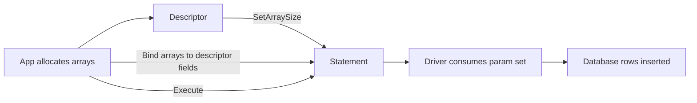
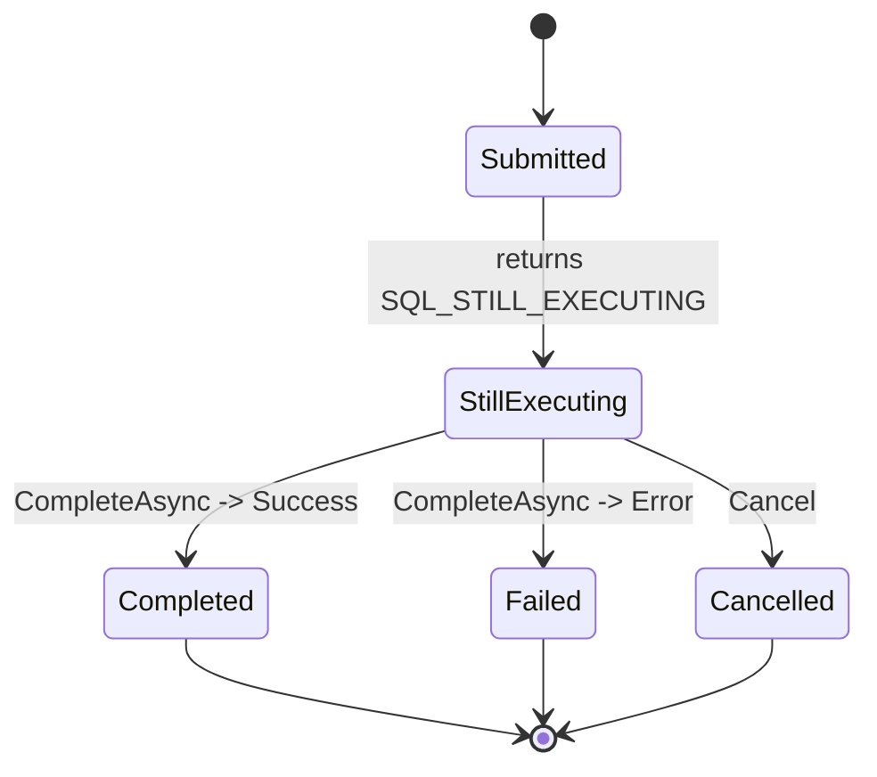

# Chapter 13 — Advanced Topics: Descriptors, Asynchronous Operations and Bookmarks (Development Plan)

Goal
- Cover advanced ODBC/`HODBC.h` features: `Descriptor` usage for complex parameter/column metadata and array/bulk operations, asynchronous execution patterns and `CompleteAsync` flow, and bookmarks/positioned update/delete (driver-dependent). Provide patterns, code sketches, mermaid diagrams and MathJax formulas to reason about sizing and performance.

Learning outcomes
- Use `Descriptor` to inspect and manipulate parameter/column metadata and implement array/bulk bindings for complex types.
- Implement non-blocking/asynchronous statement execution, poll/complete patterns, and safe state transitions with `CompleteAsync`.
- Understand bookmarks and positioned operations, when drivers support them, and how to use them safely for positioned updates/deletes.
- Evaluate tradeoffs: complexity vs performance and portability constraints across drivers.

Target audience and prerequisites
- Readers who completed earlier chapters and are comfortable with `HODBC.h` basics (Environment/Connection/Statement), binding, fetching and transaction patterns.
- Requires a SQL Server test instance and driver that supports descriptors, async and bookmarks for integration examples.

Chapter outline (sections and content)

1. Chapter opening — scope and portability note
   - Explain advanced nature, driver-dependence (notes for MS ODBC driver), and testing recommendations.

2. Descriptor fundamentals
   - `SQLGetDescField` / `SQLSetDescField` basics mapped to `HODBC::Descriptor` wrapper.
   - Descriptor header fields: `DESC_COUNT`, `DESC_ARRAY_SIZE`, `DESC_TYPE`, `DESC_OCTET_LENGTH_PTR`, `DESC_INDICATOR_PTR`, `DESC_DATA_PTR` and how `HODBC` exposes them.
   - Use-cases: complex parameter sets, array binding of different-length elements, binding LOBs with descriptor-driven offsets.

3. Descriptor array binding patterns
   - Pattern: allocate arrays for data buffers, length/indicator arrays, set descriptor `ArraySize` and per-field descriptor entries, call `Execute` with `ParamSetSize`.
   - Memory math (MathJax): total memory for multi-column array binding with `m` rows and `k` columns where column j uses B_j bytes per element:

   $$M_{total} = m \times \sum_{j=1}^{k} B_j$$

   - Show example pseudocode and mermaid diagram for descriptor lifecycle.

4. Descriptor-based metadata inspection
   - Reading driver-supplied column metadata (type, precision, scale, nullable) via descriptor fields to build adaptive buffers at runtime.
   - Example: probe result set with `SQLDescribeCol`/descriptor and allocate `FixedDB*` or `DBBinary` accordingly.

5. Asynchronous operations overview
   - ODBC async model: `SQLSetStmtAttr(SQL_ATTR_ASYNC_ENABLE, SQL_ASYNC_ENABLE_ON)`, `SQLExecute` returns `SQL_STILL_EXECUTING` / `Result::StillExecuting` and `SQLCompleteAsync` / `CompleteAsync` to finish.
   - `HODBC` helper methods for `CompleteAsync` and `Cancel` / `CancelAsync` semantics.
   - Async state machine: Submitted -> StillExecuting -> Completed/Failed/NeedData.

6. Async programming patterns and polling strategies
   - Polling vs event-driven approaches; recommended pattern for wide compatibility: submit, poll with exponential backoff and call `CompleteAsync` when `StillExecuting` observed.
   - Backoff MathJax formula with base interval $T_0$, multiplier $r$, attempt $n$:

   $$T_n = T_0 \times r^{n}$$

   - Add jitter to avoid thundering-herd: $T_n' = T_n \times (1 + U(-\alpha, \alpha))$.

7. Safe state transitions and cleanup
   - Ensure `Cancel` and `Close` semantics are safe while async operations are pending; use `CompleteAsync` or `Cancel` then `Close` per `HODBC` guidance.
   - Example try/finally patterns and RAII wrappers for async operations.

8. Bookmarks and positioned update/delete
   - Explain bookmark concept: driver-provided opaque identifiers for current row positions; `SQLGetBookmark`/`SQLSetPos` semantics and `HODBC` exposure if present.
   - Use-cases: positioned update/delete in scrollable cursors; caveats: driver support, resource usage, concurrency and locking implications.
   - Example: fetch row, get bookmark, later `SetPos` to that bookmark and call positioned update/delete; show mermaid sequence.

9. Combined advanced scenarios
   - Descriptor + Async: submitting large array/bulk operation asynchronously and completing while streaming or polling.
   - Bookmarks + Concurrency: using bookmarks with optimistic concurrency patterns and verifying row-state before positioned update.

10. Examples and walkthroughs
    - Example A: Descriptor-based bulk insert of a composite row type (multiple columns including binary and strings) using array binding.
    - Example B: Async execute with polling and `CompleteAsync` demonstration; show cancel path.
    - Example C: Positioned update using bookmark on a scrollable cursor (driver-dependent; include gating and fallback path).

11. Exercises
    - Exercise 1: Implement descriptor array-binding for mixed-column bulk insert with `m` rows and measure memory footprint using the formula above.
    - Exercise 2: Implement an async execute wrapper that uses exponential backoff with jitter and times out after `T_{max}`.
    - Exercise 3: Implement a positioned delete using bookmarks; fallback to `WHERE primaryKey = ?` if driver does not support bookmarks.

12. Deliverables & artifact locations
    - Chapter markdown: `Harlinn.ODBC\Documentation\Chapters\13_AdvancedTopics.md`.
    - Examples: `Examples\ODBC\DocsExamples\Advanced\` with files:
      - `DescriptorBulkInsert.cpp`
      - `AsyncExecuteComplete.cpp`
      - `BookmarksPositionedUpdate.cpp` (gated by driver capabilities)
    - README explaining gating, required driver capabilities, `HODBC_TEST_CONN` usage, and schema/setup.

13. Implementation tasks (step-by-step)
    1. Draft chapter markdown with code sketches, MathJax and Mermaid diagrams at `Chapters\13_AdvancedTopics.md`.
    2. Implement example programs under `Examples\ODBC\DocsExamples\Advanced` and add README with gating instructions.
    3. Validate descriptor bulk insert and async example builds on MSVC x64 (C++23); gate bookmark example on driver support.
    4. Add optional Boost.Test integration tests (gated by `HODBC_TEST_CONN` and driver feature flags).
    5. Peer review, polish content, run `clang-format`/`clang-tidy`, and link chapter from `Documentation\Readme.md`.

14. Acceptance criteria
- Chapter draft file exists and is linked in TOC.
- Descriptor and async examples compile (MSVC x64, C++23) and demonstrate intended patterns when valid connection and driver support are available.
- Bookmark example either runs when driver supports it or documents fallback path; README clearly documents gating and prerequisites.
- Chapter documents memory math and backoff formulas (MathJax) and includes mermaid diagrams for descriptor lifecycle, async state machine, and bookmark sequence.
- Code and docs follow repository rules: C++23, XML-doc for public snippets, PascalCase types, camelCase parameters, private fields trailing underscore.

15. Mermaid diagrams (embed in chapter)

Descriptor bulk binding lifecycle



Async execution state machine



Bookmark positioned update sequence

```mermaid
sequenceDiagram
  participant App
  participant Stmt
  participant Driver
  App->>Stmt: Execute with scrollable cursor
  Stmt-->>App: Fetch row
  App->>Stmt: SQLGetBookmark -> bookmark
  App->>App: store bookmark
  ... later ...
  App->>Stmt: SQLSetPos(bookmark)
  App->>Stmt: Execute positioned UPDATE/DELETE
  Stmt-->>Driver: perform positioned operation
```

16. Estimated effort
- Draft chapter: 3–5 hours.
- Implement examples and tests: 3–6 hours (driver capability gating affects time).
- Review & polish: 1–2 hours.
- Total: ~7–13 hours.

Notes
- Emphasize portability: test advanced features with target MS ODBC driver; provide fallbacks and clear gating in READMEs.
- Follow `.github/copilot-instructions.md` and workspace style rules (C++23, XML docs, naming conventions, Boost.Test for tests).