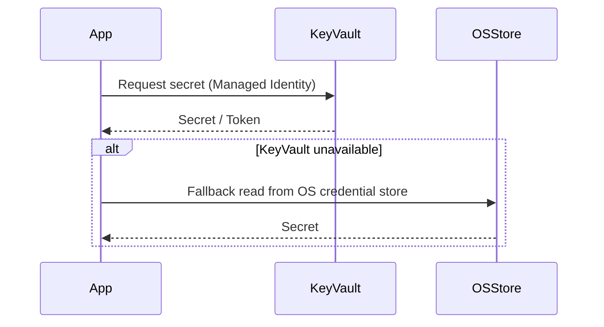
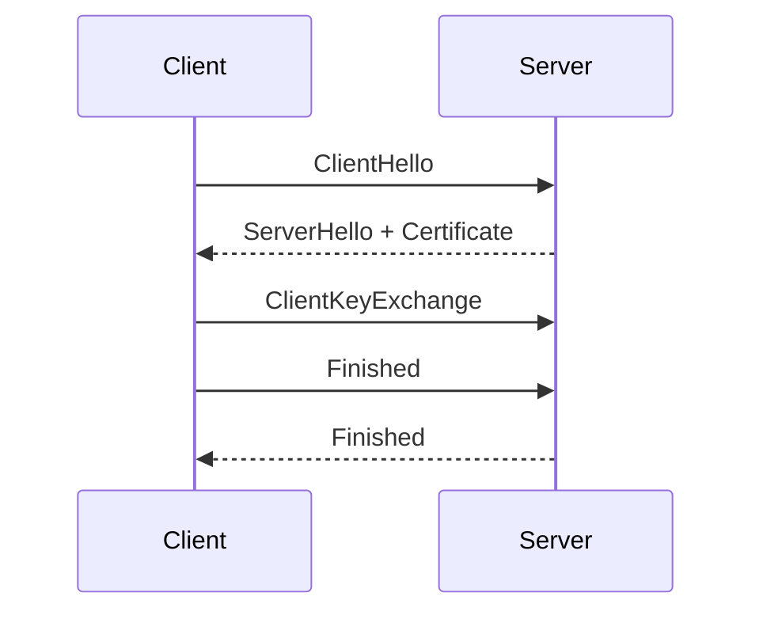

# Chapter 15 — Security, Authentication and Encryption (Development Plan)

Goal
- Produce a practical, security-focused chapter that explains authentication options, secure handling of connection strings and secrets, TLS/encryption configuration for Microsoft ODBC Driver for SQL Server, and best practices for protecting data in transit and at rest when using `HODBC.h`.

Learning outcomes
- Understand authentication modes supported by SQL Server and ODBC drivers (Windows Integrated / Kerberos, NTLM, SQL Authentication, Azure AD, Managed Identity) and when to use each.
- Configure and validate TLS/SSL encryption for ODBC connections and understand trade-offs (performance, trust model, certificate validation).
- Implement secure secret handling patterns (environment variables, OS credential stores, Azure Key Vault) and avoid insecure practices (hard-coded credentials, logging secrets).
- Implement connection string hygiene, parameter redaction in logs, and secure default options in code and examples.
- Understand threat mitigations (man-in-the-middle, credential theft, privilege escalation) relevant for database connectivity and recommended defenses.

Target audience and prerequisites
- Readers who have completed earlier chapters and need to deploy `HODBC`-based apps in secure environments.
- Prereqs: basic knowledge of SQL Server authentication, TLS fundamentals, and access to environment where TLS and authentication options can be configured for testing.

Chapter outline (sections and brief contents)

1. Chapter opening — security-first mindset
   - Brief principles: least privilege, defense in depth, fail-safe defaults, and auditability.

2. Authentication options and configuration
   - SQL Server (SQL Authentication): username/password; when used (legacy apps, cross-platform). Risks: credential theft and replay.
   - Windows Integrated Authentication (Kerberos/NTLM): benefits (no password in connection string, mutual auth with Kerberos), requirements (SPNs, AD, constrained delegation if required).
   - Azure AD authentication and Managed Identity (if applicable): flow, token-based auth and OAuth 2.0 patterns.
   - Choosing authentication: prefer integrated/managed identity when possible; use SQL auth only when necessary and rotate credentials frequently.

   Mermaid diagram — Authentication selection flow

```mermaid
flowchart LR
  App --> Decide{Is application running in AD / Azure?}
  Decide -- Yes (domain) --> Kerberos[Use Kerberos / Integrated Auth]
  Decide -- Yes (Azure) --> AzureAD[Use Azure AD / Managed Identity]
  Decide -- No --> SQLAuth[Use SQL Authentication (rotate secrets)]
```

3. Connection string security and redaction
   - Typical connection string parameters and sensitive fields (`UID`, `PWD`, `Authentication`, `AccessToken`).
   - Always avoid embedding credentials in source. Use environment variables or secure stores.
   - Guidelines for logging: redact `PWD` and `AccessToken` before writing logs. Provide code snippet pattern (pseudocode) and a logging filter rule.

4. Secret management patterns
   - Environment variables (process-level): simple, works cross-platform; risk: process environment visibility and accidental logging.
   - Configuration files with OS-level protection: files with restricted ACLs, but avoid bundling in repos.
   - OS credential stores: Windows Credential Manager / DPAPI, macOS Keychain, Linux secret stores (libsecret). Example: using Windows Data Protection API (DPAPI) or Credential Manager to store database credentials.
   - Cloud secret stores: Azure Key Vault examples (managed identity + secret retrieval at runtime).
   - Code pattern: fetch secret at process startup, populate secure container, zero memory after use where feasible.

   Mermaid diagram — Secret retrieval flow



5. TLS / Encryption configuration for ODBC
   - ODBC driver parameters affecting encryption: `Encrypt`, `TrustServerCertificate`, `TrustServerCertificate=false`, `Encrypt=yes` examples.
   - When to set `TrustServerCertificate=yes` (only in dev/test with known network isolation) vs production must validate server certs.
   - Certificate validation: ensure server certificate common name / SAN matches server name in connection string (or use `HostNameInCertificate` where supported). Use CA-signed certs or enterprise CA.
   - TLS version selection and performance trade-offs; prefer modern TLS 1.2 / 1.3 where supported by OS and driver.

   MathJax: handshake time model

   - Approximate additional latency per connection due to TLS handshake:

   $$t_{conn} = t_{tcp} + N_{rtt} \times t_{rtt} + t_{crypto}\
   \text{(where $N_{rtt}$ is RTTs required by handshake)}$$

   - Recommendations: enable connection pooling to amortize handshake cost across sessions.

   Mermaid diagram — TLS handshake (simplified)



6. Token-based authentication (Azure AD / OAuth)
   - Access token lifecycle: acquire short-lived token, include in connection (e.g., via `AccessToken` property), refresh when expired.
   - Avoid logging tokens. Use secure token caches with appropriate ACLs.

7. Least privilege and role assignment
   - Database permissions: assign minimal roles/permissions for app accounts; avoid `sa` or high-privilege roles.
   - Application-level separation: use separate accounts for different services and rotate credentials independently.

8. Data protection at rest and in backups
   - Recommendations: enable Transparent Data Encryption (TDE) on SQL Server for disk-level encryption; protect backup keys and access to backup files.
   - Note: TDE protects data files; still use TLS for data-in-transit.

9. Auditing, logging and monitoring
   - Audit successful and failed logins, high-privilege actions and schema changes. Use SQL Server Audit or Extended Events.
   - Monitor for unusual authentication patterns and failed login spikes.

   MathJax: simple anomaly detection threshold

   $$\text{errorRate} = \dfrac{F}{T}$$

   Trigger alert when \(\text{errorRate} > \theta\) (e.g., \(\theta=0.05\)).

10. Secure coding patterns in `HODBC` examples
    - Show code patterns for:
      - Reading connection string from `HODBC_TEST_CONN` environment variable only in examples; prefer secret retrieval in production code.
      - Redacting secrets before logging connection strings.
      - Using scoped containers for sensitive buffers and zeroing buffers after use where feasible.
    - Use RAII patterns to ensure connections are closed and credentials are not leaked in long-lived memory.

11. Compliance and regulatory considerations
    - Note data residency, encryption-at-rest, key management and compliance frameworks (e.g., PCI-DSS, HIPAA) as they affect connection configuration and key lifecycle.

12. Examples and walkthroughs
    - Example A: sample `BuildAndConnectSecure.cpp` demonstrating:
      - Reading server name from env var, retrieving password from Windows Credential Manager (or Azure Key Vault if configured), building connection string with `Encrypt=yes;TrustServerCertificate=no;` and opening connection.
      - Logging connection attempt without exposing `PWD`.
    - Example B: token-based connection using an acquired Azure AD access token (pseudocode and gating notes).
    - Example C: connection pooling demo showing reduced TLS handshake overhead.

13. Exercises
    - Exercise 1: Configure SQL Server with a CA-signed cert, update example connection string with `Encrypt=yes;TrustServerCertificate=no`, and verify certificate validation succeeds.
    - Exercise 2: Implement secret retrieval from OS credential store and replace a hard-coded connection string in an example.
    - Exercise 3: Simulate credential leakage by logging full connection strings in a test, then implement and verify redaction filter prevents secrets from appearing in logs.

14. Deliverables & artifact locations
    - Chapter markdown: `Harlinn.ODBC\Documentation\Chapters\15_SecurityAuthenticationAndEncryption.md`.
    - Examples: `Examples\ODBC\DocsExamples\Security\` with files:
      - `BuildAndConnectSecure.cpp` (env var + OS secret retrieval + TLS config)
      - `AzureADTokenConnect.cpp` (pseudocode / gated example)
      - `ConnectionPoolingTlsDemo.cpp` (show pooling amortizes TLS cost)
    - README describing required configuration, how to store secrets, and gating using `HODBC_TEST_CONN`.

15. Implementation tasks (step-by-step)
    1. Draft chapter markdown with mermaid diagrams and MathJax formulas at `Chapters\15_SecurityAuthenticationAndEncryption.md`.
    2. Implement `BuildAndConnectSecure.cpp` and README under `Examples\ODBC\DocsExamples\Security` (use platform-appropriate secret-retrieval APIs; provide fallback to env var for CI).
    3. Add pseudocode for Azure AD token connection and guidance for acquiring tokens via MSAL (do not include secrets in repo).
    4. Validate examples build on MSVC x64 (C++23) and run where credentials and certs are available; gate execution via `HODBC_TEST_CONN` and documented setup.
    5. Peer review, apply feedback, and link chapter from `Harlinn.ODBC\Documentation\Readme.md`.

16. Acceptance criteria
    - Chapter draft exists and is linked from the TOC.
    - Examples compile with MSVC x64 / C++23 and demonstrate secure patterns when configured properly (gated by `HODBC_TEST_CONN`).
    - Chapter provides concrete, actionable guidance for authentication selection, TLS configuration, secret management, redaction, and auditing.
    - Code and documentation follow repository rules: C++23, XML-style doc for public snippets, PascalCase types, camelCase parameters, private fields trailing underscore, and use Boost.Test for tests where applicable.

17. Estimated effort
    - Draft chapter: 3–5 hours.
    - Implement examples and README: 2–4 hours (depends on test environment availability).
    - Review & polish: 1–2 hours.
    - Total: ~6–11 hours.

Notes and security cautions
- Never commit secrets to source control. All examples that demonstrate secret retrieval must explicitly document how to configure secrets externally.
- When demonstrating `TrustServerCertificate=yes`, explicitly label it as insecure and for development only.
- Prefer managed identity / token-based auth for deployed cloud-hosted apps.

If you want I can now create the chapter draft file and the example files under `Examples\ODBC\DocsExamples\Security`.