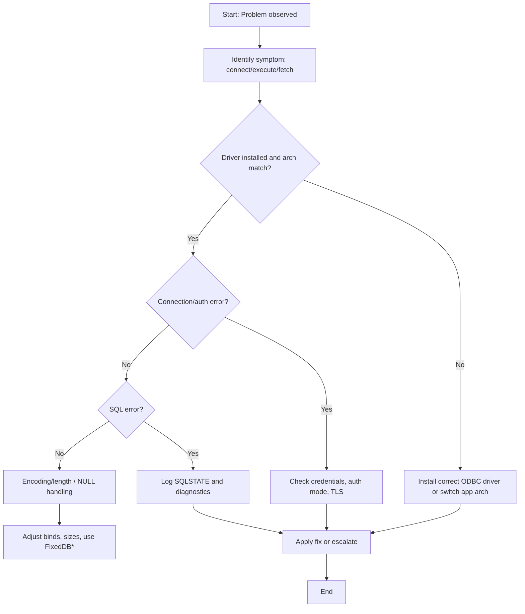

# Chapter 16 — Testing, Logging and Troubleshooting (Development Plan)

Goal
- Provide practical guidance and examples for testing database code written against `HODBC.h`, robust logging strategies for production and development, and a concise troubleshooting checklist for common problems. Include measurable practices, example test harnesses (Boost.Test), logging formats, and diagnostics capture patterns.

Learning outcomes
- Implement unit and integration tests for `HODBC`-based code using Boost.Test and gated integration tests using `HODBC_TEST_CONN`.
- Design logging that balances signal/noise, avoids leaking secrets, and captures diagnostics (SQLSTATE, NativeError, message, statement, parameters) in structured form.
- Apply troubleshooting steps to diagnose driver, configuration, encoding, and runtime errors and recover where possible.
- Measure test coverage and error rates and apply simple math-based alerting heuristics.

Target audience and prerequisites
- Readers who completed earlier chapters and can compile examples with MSVC x64 (C++23).
- Familiarity with Boost.Test, CI gating, and basic logging libraries (spdlog, or repo logging utilities).

Chapter outline (sections and contents)

1. Introduction — testing strategy overview
   - Distinguish unit tests (logic, mocks) vs integration tests (actual DB). Prefer many fast unit tests + a smaller set of gated integration tests.

2. Test harness and conventions
   - Use Boost.Test for C++ unit tests per repo rules. Test project layout: `Tests\Harlinn.ODBC.Tests` with `Unit` and `Integration` subfolders.
   - Naming convention: `ModuleName_WhatIsTested_ExpectedBehaviour` (PascalCase for test suites). Configure test runner to read `HODBC_TEST_CONN` env var for integration tests and skip if missing.
   - Example Boost.Test macro usage and fixture for connection setup/teardown.

3. Mocking ODBC interactions for unit tests
   - Strategy: isolate ODBC-dependent code behind interfaces/adapters so you can inject mocks. Use small test adapters that simulate `Result` codes, diagnostic records and fetch patterns.
   - Example: `IConnection` / `IStatement` lightweight interfaces and a `MockStatement` implementation to test error handling logic.

4. Integration tests: gating and environment
   - Gate integration tests with `HODBC_TEST_CONN`. Use disposable schemas or transactions that rollback at test end to keep DB state clean.
   - Use `Environment` and `Connection` fixtures that read connection string from env var and fail fast with helpful message if missing.
   - Parallelization: run integration tests sequentially by default or use separate databases per worker to avoid conflicts.

5. Test data and fixtures
   - Use transactional fixtures: begin transaction in setup, run test, rollback in teardown to isolate state. For tests that must persist, create and drop schema objects in setup/teardown.
   - Use small, deterministic datasets and avoid reliance on external data.

6. Logging strategy
   - Structured logging (JSON) recommended for diagnostics and correlation. Log fields: timestamp, level, component, correlationId, connectionId, statement, parameters (redacted), SqlState, NativeError, DiagnosticMessage.
   - Logging levels: Debug, Info, Warn, Error, Fatal. Use Debug for developer traces (bind details), Info for high-level operations, Warn for recoverable issues, Error for failures.
   - Example log schema (JSON) and redaction rule for sensitive keys (pwd, accessToken).

7. Diagnostics capture pattern
   - On any `Result` failure, collect all diagnostic records via `Internal::GetDiagnosticRecord` for the handle (statement/connection) and include in log/exception payload.
   - Example code pattern pseudocode showing collection and structured logging.

8. Monitoring and alerting heuristics (MathJax)
   - Error rate over window W seconds: if E errors observed and R requests processed, error ratio is

   $$\text{errorRatio} = \frac{E}{R}$$

   - Trigger an alert when

   $$\text{errorRatio} > \theta$$

   where \(\theta\) is a configurable threshold (e.g., 0.05 for 5%).

   - Example: compute rolling average using exponential moving average (EMA) with smoothing factor \(\alpha\):

   $$\text{EMA}_t = \alpha\times x_t + (1-\alpha) \times \text{EMA}_{t-1}$$

   - Choose \(\alpha\) based on responsiveness vs noise.

9. Troubleshooting checklist and flow (mermaid)
   - High-level troubleshooting flowchart to diagnose common issues: driver not found, architecture mismatch, authentication failures, encoding/length mismatches, `SQL_NULL_DATA` surprises, disconnected sessions (`08003`), timeout/latency problems.

10. Common troubleshooting scenarios and fixes
    - Driver not found or architecture mismatch: ensure x64 driver for x64 app; show how to check installed drivers and use `odbcad32.exe` (64-bit vs 32-bit) or `SQLGetInstalledDrivers`.
    - Authentication/permission error: ensure credentials, integrated auth SPN, encryption settings; collect `SqlState` and `NativeError`.
    - Encoding and length mismatches: validate bind sizes, convert between bytes and chars for wide strings (see earlier chapters), and check `SQL_NO_TOTAL` for streaming columns.
    - SQL_NULL_DATA handling: ensure `DBValue::IsNull()` checks and correct indicator pointer usage.
    - Disconnected sessions (`08003`): detect and reconnect logic, or surface user-friendly error.

11. Logging for tests
    - Capture logs during tests and attach to test reports for integration failures. Use file-per-test or in-memory capture with a test fixture that writes artifacts to `TestResults` folder.
    - Example: when integration test fails, collect the last N log entries and the diagnostic records and attach to test artifact bundle.

12. Examples and artifacts
    - Test examples: `Tests\Harlinn.ODBC.Tests\Unit\ConnectionMockTests.cpp`, `Integration\ConnectionIntegrationTests.cpp` (gated by `HODBC_TEST_CONN`).
    - Logging examples: `Examples\ODBC\DocsExamples\Logging\StructuredLoggingExample.cpp` and README showing redaction rules.
    - Troubleshooting scripts: small PowerShell scripts to validate driver, architecture, and basic connectivity (`CheckODBCDriver.ps1`, `TestConnection.ps1`).

13. Implementation tasks (step-by-step)
1. Draft chapter markdown file at `Harlinn.ODBC\Documentation\Chapters\16_TestingLoggingAndTroubleshooting.md` with sections, diagrams and MathJax formulas.
2. Add test skeletons to `Tests\Harlinn.ODBC.Tests` demonstrating unit mocks and integration gating using `HODBC_TEST_CONN`.
3. Implement structured logging example and redaction utility under `Examples\ODBC\DocsExamples\Logging`.
4. Add troubleshooting helper scripts under `Tools\ODBC` and document usage in the chapter.
5. Run local test builds (MSVC x64, C++23) and ensure Boost.Test-based tests compile; run unit tests locally.
6. Peer review, apply feedback, ensure examples follow style rules and include XML-doc for public APIs where applicable.
7. Link chapter from `Harlinn.ODBC\Documentation\Readme.md`.

14. Acceptance criteria
- `Chapters\16_TestingLoggingAndTroubleshooting.md` created and linked in TOC.
- Unit and integration test skeletons present and building under `Tests\Harlinn.ODBC.Tests` (integration tests gated by `HODBC_TEST_CONN`).
- Logging example demonstrates structured JSON logging and redaction and compiles under MSVC x64 (C++23).
- Troubleshooting scripts are present and documented.
- Documentation and code follow repo rules: C++23, Boost.Test for tests, PascalCase types, camelCase parameters, private fields trailing underscore, XML-style `///` for public APIs, run `clang-format`/`clang-tidy` before committing.

15. Estimated effort
- Draft chapter: 3–5 hours.
- Implement tests and logging examples: 2–4 hours.
- Create troubleshooting scripts and validate: 1–2 hours.
- Review & polish: 1–2 hours.
- Total: ~7–13 hours.

If you want I can now create the chapter draft file and the test and example skeleton files. Which would you like next?