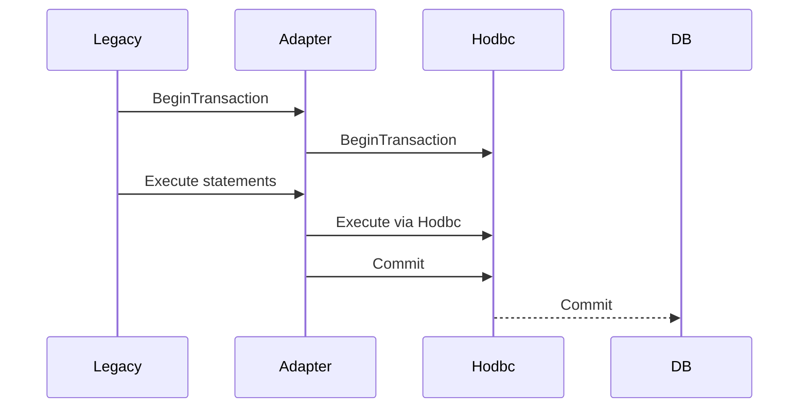

# Chapter 18 — Migration and Interop: From Legacy ODBC and ADO.Net (Development Plan)

Goal
- Provide a practical, pragmatic guide to migrate code from raw ODBC and ADO.NET to `HODBC.h`. Cover mapping of concepts and APIs, migration patterns, interoperability techniques, testing strategies, and compatibility checks. Include examples, checklists, and tooling notes.

Learning outcomes
- Map legacy ODBC handle-based calls and ADO.NET patterns to `HODBC.h` equivalents and idioms.
- Implement migration patterns that preserve behavior while adding RAII, typed containers and diagnostics.
- Verify interoperability scenarios where legacy code and `HODBC` coexist (shared connections, transaction boundaries, connection pooling).
- Establish test and rollout procedures, benchmarks and fallbacks.

Target audience and prerequisites
- C++ and .NET developers maintaining code that uses classic ODBC APIs or ADO.NET and planning to adopt `HODBC.h`.
- Familiarity with ODBC basics (handles, `SQLRETURN`, indicators) and ADO.NET concepts (Connection, Command, DataReader, DataAdapter).

Chapter outline (sections and content)

1. Overview and migration strategy
   - Two migration approaches: incremental (wraps + adapters) vs big-bang (full rewrite). Risk/benefit summary.
   - Diagram: migration flow (mermaid).

2. Mapping legacy ODBC constructs to `HODBC.h`
   - Table-style mapping (conceptual):
     - `SQLAllocHandle` ? `SqlHandle<HandleType::...>` / `Environment` / `Connection` wrapper
     - `SQLConnect` / `SQLDriverConnect` ? `Connection::Open` / `Connection` constructor patterns
     - `SQLPrepare` / `SQLExecDirect` ? `Statement::Prepare` / `Statement::Execute` helpers
     - `SQLBindParameter` ? `Statement::BindParameter` / `DBValue<T>` / `FixedDB*` containers
     - `SQLBindCol` / `SQLGetData` ? `BindColumn`, `DataReader`, `GetData` helpers
     - `SQLGetDiagRec` ? `Internal::GetDiagnosticRecord`
   - Show short code sketches comparing legacy ODBC and `HODBC` idioms.

3. Mapping ADO.NET patterns to `HODBC.h` concepts
   - ADO.NET `SqlConnection` ? `Connection` (connection string usage, integrated auth patterns)
   - `SqlCommand` + parameters ? `Statement` + `BindParameter`
   - `SqlDataReader` ? `DataReader` or bound-column pattern
   - `DataAdapter` / `DataSet` ? consider mapping to custom in-memory containers or use ADO.NET side-by-side until fully migrated

4. Interop scenarios and coexistence
   - Shared connection pools: ensure same driver and pooling settings; note `HODBC` pooling enums and environmental ordering requirements.
   - Transaction handoff: ADO.NET transactions vs ODBC transactions — ensure single transaction manager semantics. If mixed layers must share transactions, prefer promoting transaction control to one layer and expose an adapter.
   - Pointer/handle ownership: avoid double-free by ensuring `HODBC` RAII owns handles you pass to legacy code or use raw handle accessors cautiously.

5. Adapter patterns and thin shims
   - Build adapters that expose an ODBC-like API backed by `HODBC` to allow incremental replacement of caller modules.
   - Example adapter methods: `LegacyExecuteDirect(const char* sql)` implemented via `HODBC` `Statement`.
   - For ADO.NET interop, create a managed wrapper that calls into native `HODBC` via C++/CLI or a native interop layer.

6. Testing strategy and verification
   - Unit tests: mock statements and connections; verify parameter binding and indicator behavior.
   - Integration tests: run against representative DB; use rollback or disposable schema. Gate via `HODBC_TEST_CONN`.
   - Regression tests: capture query results and rowcounts from legacy system and compare to `HODBC`-based runs (diff-based validation).

7. Performance validation (MathJax)
   - For migration, compare throughput before/after for representative workloads. Rows/sec model:

   $$R \approx \frac{N}{t_{overhead} + N\times t_{row}}$$

   - Compute relative change and set acceptance threshold (example: no worse than 5% drop) or document tuning steps (prepared statements, array binding).

8. Diagnostics and failure modes
   - Map common legacy error handling to `HODBC` diagnostics: ensure code checks `Result` and collects `SqlState`/`DiagnosticRecord`.
   - Document common pitfalls (indicator pointer mismatches, wide/ANSI length confusion, driver-specific behavior like `SQL_NO_TOTAL`).

9. Rollout and fallback plan
   - Staged rollout steps: module-by-module migration using adapters, canary deployments, monitoring of error ratios and latency.
   - Fallback: keep legacy path behind a feature flag or config until `HODBC` path is validated.

10. Examples and artifacts
    - Example migration snippets under `Examples\ODBC\MigrationExamples\`:
      - `OdbcToHodbc_SimpleQuery.cpp` (line-by-line comparison)
      - `AdoNetInteropExample` (pseudocode for managed wrapper)
      - `AdapterLegacyApi.cpp` (thin shim exposing legacy C API using `HODBC` internally)

11. Implementation tasks (step-by-step)
    1. Draft chapter markdown `Chapters\18_MigrationAndInterop.md` with mappings, diagrams and code sketches.
    2. Add migration example files under `Examples\ODBC\MigrationExamples` and README with migration checklist.
    3. Write adapter/shim example implementing a small subset of legacy API via `HODBC`.
    4. Build and run integration comparisons; collect baseline and migrated timings; include sample benchmark results in chapter.
    5. Peer review and finalize; link chapter from main TOC.

12. Acceptance criteria
- Chapter file exists and is linked from `Readme.md`.
- Migration examples compile and demonstrate mapping patterns.
- Adapter shim example builds and can be used to route legacy calls to `HODBC`.
- Testing strategy documented and basic regression harness included.

13. Mermaid diagrams

Migration flow (incremental)

```mermaid
flowchart LR
  LegacyModuleA --> AdapterA[Adapter/Shim]
  AdapterA --> HodbcLib[HODBC.h]
  HodbcLib --> SQLServer[SQL Server]
  LegacyModuleB --> LegacyDriver[Legacy ODBC/ADO.NET]
  LegacyDriver --> SQLServer
  note right of AdapterA: Replace slowly; remove adapter when all callers migrated
```

Transaction/coexistence caution



14. Estimated effort
- Draft chapter: 2–4 hours.
- Implement examples and adapter: 3–5 hours.
- Integration testing and benchmarks: 2–4 hours.
- Review & polish: 1–2 hours.
- Total: ~8–15 hours.

Notes and repo rules
- Use C++23 for examples and follow XML-style `///` doc rules for any public APIs.
- Follow naming conventions: PascalCase types, camelCase parameters, private fields with trailing underscore.
- Gate integration runs with `HODBC_TEST_CONN` and avoid committing any secrets.

If you want I can now create the chapter draft file and the migration example files under `Examples\ODBC\MigrationExamples`.
