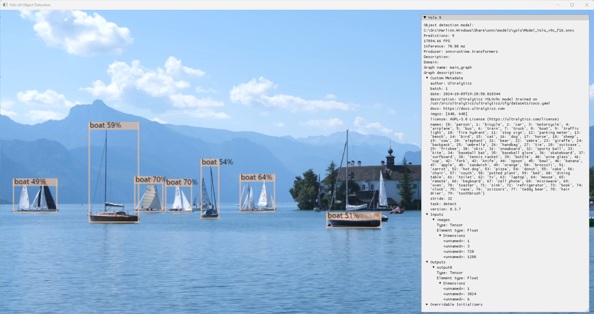

# Harlinn.Windows

This is the repository for Harlinn.Windows, a Visual Studio 2022 Solution with a wide range of useful C and C++ libraries for 64-bit Windows software development. 

## Documentation

[Harlinn.Windows](https://harlinn.github.io/Cpp/Harlinn.Windows/Harlinn.Windows.html), the solution.
- [Harlinn.AI](https://harlinn.github.io/Cpp/Harlinn.Windows/Harlinn.AI/Harlinn.AI.html) library.
  - [Harlinn.AI DirectML (DML)](https://harlinn.github.io/Cpp/Harlinn.Windows/Harlinn.AI/Harlinn.AI.DML.html)
  - [Harlinn.AI DirectML eXtensions (DML.X)](https://harlinn.github.io/Cpp/Harlinn.Windows/Harlinn.AI/Harlinn.AI.DML.X.html)
  - [Using the ONNX runtime with the DirectML execution provider (Harlinn.AI.ONNX.DirectML)](https://harlinn.github.io/Cpp/Harlinn.Windows/Harlinn.AI/Harlinn.AI.ONNX.DirectML.html)
- [Harlinn.Common.Core](https://harlinn.github.io/Cpp/Harlinn.Windows/Harlinn.Common.Core/Harlinn.Common.Core.html) library.
  - [Fast Linear Algebra Classes for Games and Graphics](https://harlinn.github.io/Cpp/Cpp/Math/FastLinearAlgebra.html)
  - [Single Instruction Multiple Data (SIMD)](https://harlinn.github.io/Cpp/Cpp/Math/SimdOperations.html)
  - [Optimized basic math functions](https://harlinn.github.io/Cpp/Cpp/Math/BasicMath.html)
  - [C++ classes for Working with Threads, Processes and Kernel Mode Synchronization](https://harlinn.github.io/Cpp/Harlinn.Windows/Harlinn.Common.Core/WindowsSynchronization.html)
  - [C++ classes for Windows User Mode Synchronization](https://harlinn.github.io/Cpp/Harlinn.Windows/Harlinn.Common.Core/UserModeWindowsSynchronization.html)
  - [C++ classes for High Performance Extensible Storage Engine Development](https://harlinn.github.io/Cpp/Harlinn.Windows/Harlinn.Common.Core/ESE/EsePart1.html)
  - [The Component Object Model (COM)](https://harlinn.github.io/Cpp/Harlinn.Windows/Harlinn.Common.Core/COM/COM.html)
    - [COM Interface Basics](https://harlinn.github.io/Cpp/Harlinn.Windows/Harlinn.Common.Core/COM/COMInterfaceBasics.html)
    - [Core interface wrappers and smart pointers](https://harlinn.github.io/Cpp/Harlinn.Windows/Harlinn.Common.Core/COM/COMCoreWrappers.html)
    - [Implementing COM objects and interfaces in C++](https://harlinn.github.io/Cpp/Harlinn.Windows/Harlinn.Common.Core/COM/COMImplentingInterfaces.html)
- [Harlinn.OCI](https://harlinn.github.io/Cpp/Harlinn.Windows/Harlinn.OCI/Harlinn.OCI.html) library.
  - [Introduction to Harlinn.OCI](https://harlinn.github.io/Cpp/Harlinn.Windows/Harlinn.OCI/Harlinn.OCI.Introduction.html)
- [Harlinn.ODBC](https://harlinn.github.io/Cpp/Harlinn.Windows/Harlinn.ODBC/Harlinn.ODBC.html) library.
- [Harlinn.Windows](https://harlinn.github.io/Cpp/Harlinn.Windows/Harlinn.Windows/Harlinn.Windows.html) library.
- [3rd Party Libraries](https://harlinn.github.io/Cpp/Harlinn.Windows/3rdParty/3rdParty.html)
- [Build instructions](./Readme/Build.md)

### Doxygen generated documentation

[Doxygen generated documentation](https://harlinn.github.io/Doxygen/index.html)