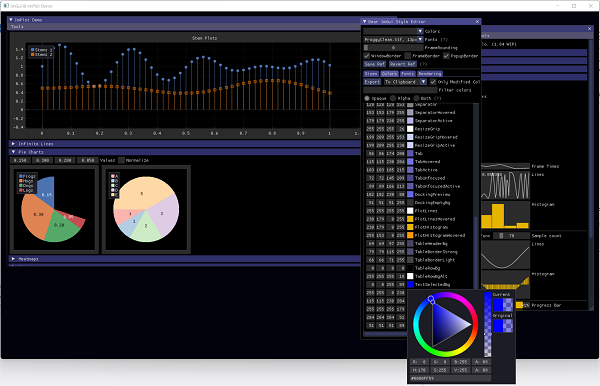
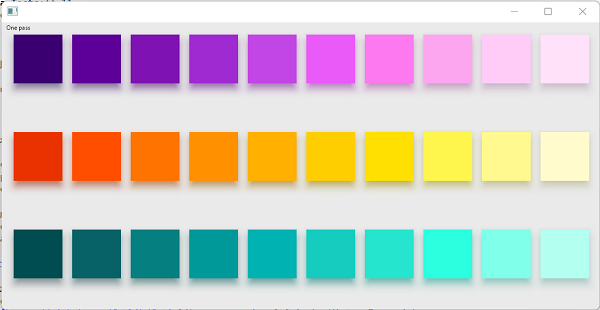
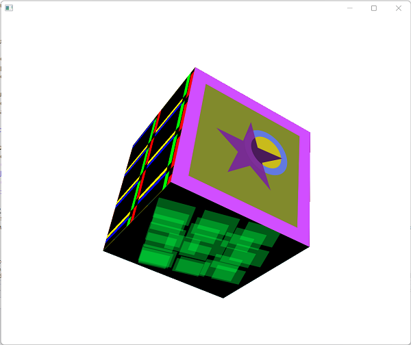
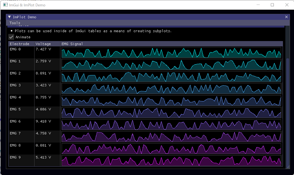

# Overview
This article describes Harlinn.Windows, a Visual Studio 2022 solution.

Before you can build the solution, please read [the build instructions](./Build.md) and configure 
your environment accordingly.  

## Introduction
Harlinn.Windows is a collection of libraries that I have put together that serves as a big part 
of the runtime we use at work. A few are my own; but most are; more or less, well-known open 
source libraries.



There are currently 624 projects in the solution, and this article provides a high-level overview of what's inside.

### Why did I not use cmake and vcpkg? 
This is a good question, and initially I tried to do just that, but there were some snags:
1. The size of the release build, using vcpkg, for grpc.lib was 325 MB; while the size of the release build of 
   Harlinn.grpc.dll is just 3.7 MB. Currently the combined size of all the native dlls created for a release 
   build of the solution is 118 MB.
2. Some packages relied on different versions of the same package, including their own private copy of a package.
3. Some packages were compiled with /sdl on, while others were not. I prefer to turn /sdl and /GS off for release builds, and on for debug builds.
   This may not be as significant as it used to, but you still get better performance when turning /sdl and /GS off. 
4. Many packages will not compile with the **/std:c++latest** option, which *enables all currently implemented compiler and standard library features proposed for the next draft standard, as well as some in-progress and experimental features.*
6. Many packages creates static libraries, not dlls. 

Don't get me wrong; I think CMake and vcpkg are great tools, but putting everything into a 
single solution makes it easier, at least for me, to understand how everything is tied together. 

### Why put Harlinn in front of every dll name?
To avoid naming conflicts. I own the harlinn.com domain, so it is unlikely that anybody would, by accident, 
put Harlinn in front of the name of their dll. These dlls are *not* drop-in replacements for the dlls that vcpkg and cmake generate, so I think it makes sense to ensure that they are uniquely named.

### What about the unit tests? 
A few of those are included, but still just a fraction of those available for the original packages.

In particular, I've included many of the unit tests, that can be expected to compile on Windows, for: 
- Abseil - 4430 tests pass, 26 fails, and 12 tests are disabled
- boringssl
  - crypto_test - 910 tests pass, 0 fails, and 0 tests are disabled
  - ssl_test - 330 tests pass, 0 fails, and 0 tests are disabled
- gRPC - the tests are implemented as 94 separate executables, using multiple approaches to testing. 
  I think that the tests pass; but I am not certain, since much of the validation was performed manually.
- bullet - 31 tests pass, 0 fails, and 0 tests are disabled
- gdal - 84 tests pass, 0 fails, and 0 tests are disabled
- skia - A fair number of the tests works, about 1500 of them, but then the test program terminates. 
  As far as I have been able to determine, this seems to be related to the test code.
  


I've also created a fair number of tests for my own projects:

- **Harlinn.Common.Core.Tests:** 3192
- **Harlinn.Windows.Tests:** 271
- **Harlinn.OCI.Tests:** 49
- **Harlinn.ODBC.Tests:** 106
- **Harlinn.Timeseries.Tests:** 10
- **Harlinn.Julia.Tests:** 11
 
All tests can be found under the Tests folder.

### What about the examples?

So far I've included 202 example projects.

All Examples can be found under the Examples and DotNet\Examples folders.

### How stable is this?

This is a snapshot of the solution, and while most things seems to work, there are bound to be some snags. 
The most common problem will be a function or variable that is not exported from a dll, and there 
are probably other bugs too. Some, probably, created by yours truly. 

Still, with this solution you can now: 
- Create nice 2D effects:
 
  

- Create animated 3D visualizations:
 
  

- Learn a lot about some of the most widely used open source packages available, using Visual Studio 2022 and C++.

## Harlinn.Common.Core
Harlinn.Common.Core is a library packaged as a dll that provide 
functionality that is useful for most Windows C++ projects.
### Dependencies
1. The [boost](https://www.boost.org/) C++ libraries

### Other 3rd party code included in Harlinn.Common.Core
The Harlinn.Common.Core library contains code from a number of libraries:
1. The [xxHash](https://github.com/Cyan4973/xxHash) library, version 0.8.1 
2. The [CRC-32C (Castagnoli) for C++](https://github.com/robertvazan/crc32c-hw) library
3. The [xxhash_cx](https://github.com/masyos/xxhash_cx) library

### About ``char``, ``wchar_t``, ``signed char`` and ``unsigned char`` 
The library tries to treat ``char`` and ``wchar_t`` as types used for the sole purpose of representing
character data, while ``signed char`` and ``unsigned char`` are expected to represent signed and unsigned 8-bit integers, respectively. 

Normally this is not much of a problem, but consider:
```C++
constexpr char buffer1[] = { 1,2,3 };
constexpr unsigned char buffer2[] = { 1,2,3 };
constexpr char buffer3[] = "hello";
constexpr int buffer4[] = { 1,2,3 };
constexpr wchar_t_ buffer5[] = { 1,2,3 };
constexpr wchar_t_ buffer6[] = L"hello";
constexpr auto length1 = LengthOf( buffer1 );
constexpr auto length2 = LengthOf( buffer2 );
constexpr auto length3 = LengthOf( buffer3 );
constexpr auto length4 = LengthOf( buffer4 );
constexpr auto length5 = LengthOf( buffer5 );
constexpr auto length6 = LengthOf( buffer6 );
```
``LengthOf`` expects ``buffer1`` and ``buffer5`` to be zero-terminated; but since they are not, the compiler will not be able to evaluate ``LengthOf( buffer1 )`` and ``LengthOf( buffer5 )``.
``LengthOf( buffer3 )`` and ``LengthOf( buffer6 )`` evaluate to 5, while ``LengthOf( buffer2 )`` and ``LengthOf( buffer4 )`` evaluate to 3.

The code in *HCCPersistent.h*, which is used by the code in *HCCLogger.h*, relies on this, eliminating a significant number of calls to ``strlen`` and ``wcslen`` at runtime. 

### Main header files:
- **HCC7BitEncoding.h:** provides constexpr support for 7-bit encoded values.
- **HCCActiveObject.h:** provides:
  - ``template<typename DerivedT> class ActiveObject``: 
   
    An [active object](https://en.wikipedia.org/wiki/Active_object) implementation based on ``ConcurrentQueue<>``. 
- **HCCApplication.h:** provides:
  - ``class Application``:
  
    Every program needs to create one, and only one, instance of this class, or a class derived from this class.
    ```C++
    int main( int argc, char* argv[], char* envp[] )
    {
        Harlinn::Common::Core::ApplicationOptions options;
        options.Load( );
        Harlinn::Common::Core::Application application( options );
        application.Start( );
    
        // your code goes here, perhaps:
        int result = foo( );

        application.Stop( );
        return result;
    }
    ```
    Currently this configures, starts and stops the logging back-end on behalf of the program.
    
- **HCCArray.h:** provides:
  - ``template<typename T, size_t N> ArrayEx``: 
   
    A template derived from std::array that supports constexpr concatenation using operator +.
  - ``template<typename T, size_t N> class Array``: 
   
    An alternative to std::array that supports constexpr concatenation using operator +.
  - ``template<size_t N> class ByteArray``: 
   
    A template that supports constexpr serialization of binary data. 
  - ``template<size_t N, bool networkByteOrder = false, bool use7BitEncodedSize = true> class ArrayReader``: 
    
    A template that implements constexpr deserialization of data.
  - ``template<size_t N, bool networkByteOrder = false, bool use7BitEncodedSize = true> class ArrayWriter``: 
    
    A template that implements constexpr serialization of data.
- **HCCBinaryReader.h:** provides:
  - ``BinaryReaderBase``:
    ```C++
    template<typename Derived, 
            bool networkByteOrder, 
            bool use7BitEncodedSize>
    class BinaryReaderBase
    ```
    A template that can be used to deserialize binary data.
  - ``BufferedBinaryReader``:
    ```C++
    template<typename StreamT, 
            size_t BufferSizeValue, 
            bool networkByteOrder = false, 
            bool use7BitEncodedSize = true> 
    class BufferedBinaryReader
    ```
    A template that can be used to deserialize binary data from a stream using an internal buffer.
  - ``BinaryReader``: 
    ```C++ 
    template< IO::StreamReader StreamT, 
            bool networkByteOrder = false, 
            bool use7BitEncodedSize = true >
    class BinaryReader
    ```
    A template that can be used to deserialize binary data from a stream.
- **HCCBinaryWriter.h:** provides:
  - ``BinaryWriterBase``:
    ```C++
    template<typename Derived, 
            bool networkByteOrder, 
            bool use7BitEncodedSize>
    class BinaryWriterBase
    ```
    A template that can be used to serialize binary data.
  - ``BufferedBinaryWriter``:
    ```C++
    template<IO::StreamWriter StreamWriterT, 
            size_t BufferSizeValue, 
            bool networkByteOrder = false, 
            bool use7BitEncodedSize = true >
    class BufferedBinaryWriter
    ```
    A template that can be used to serialize binary data to a stream using an internal buffer.
  - ``BinaryWriter``: 
    ```C++ 
    template<IO::StreamWriter StreamT, 
            bool networkByteOrder = false, 
            bool use7BitEncodedSize = true>
    class BinaryWriter
    ```
    A template that can be used to serialize binary data to a stream.
- **HCCBuffer.h:** provides ``Blocks::Stream`` a block oriented memory stream.
- **HCCCom.h:** provides:
  - ``class Unknown``: A wrapper for the [``IUnknown``](https://docs.microsoft.com/en-us/windows/win32/api/unknwn/nn-unknwn-iunknown) interface.
  - ``template<typename T> class UnknownPtr``: A generic smart pointer for [COM](https://docs.microsoft.com/en-us/windows/win32/com/component-object-model--com--portal) interfaces.
  - ``template< class InterfaceType > class IUnknownImplementation``: An implementation of the [``IUnknown``](https://docs.microsoft.com/en-us/windows/win32/api/unknwn/nn-unknwn-iunknown) interface.
- **HCCConverters.h:** provides various overloads of: 
  ```C++
    template <typename ResultType, typename ArgumentType>
    inline ResultType ConvertTo( ArgumentType arg )
  ```
  implementing efficient and 'safe' conversion between basic data types.
- **HCCCRC.h:** provides a few ways of calculating the CRC value for data.
- **HCCCrypto.h:** provides functionality for working with certificates.
- **HCCCurrency.h:** declares the ``Currency`` class.
- **HCCDateTime.h:** provides functionality for handling date and time, declares:
  - ``class TimeSpan``
  - ``class DateTime``
  - ``class Stopwatch``
- **HCCEnvironment.h:** provides easy access to system information
- **HCCEse.h:** provides C++ classes for working with the [Extensible Storage Engine](https://docs.microsoft.com/en-us/windows/win32/extensible-storage-engine/extensible-storage-engine)
- **HCCException.h:** provides a wide range of exception classes.
- **HCCGuid.h:** functionality for working with UUIDs/GUIDs, declares ``class Guid``.
- **HCCHandle.h:** declares ``template<typename DerivedT, typename HandleT> class Handle``
- **HCCHTTP.h:** provides C++ classes for working with the [HTTP Server API](https://docs.microsoft.com/en-us/windows/win32/http/http-api-start-page).
- **HCCIO.h:** provides file, directory, and stream I/O related C++ classes. 
- **HCCIOContext.h:** declares:
  - ``class Context``: uses a thread-pool to process asynchronous I/O for an [I/O completion port](https://docs.microsoft.com/en-us/windows/win32/fileio/i-o-completion-ports) 
  - ``class ContextHandler``: An instance of the ``Context`` class delegates the work for a particular OS 
    handle to the ``Process`` override implemented for a class derived from ``ContextHandler``. 
  - ``template<typename DerivedT> FileHandler``: A template derived from ``ContextHandler`` used to perform file related asynchronous I/O.
  - ``class FileRequest``: Base class for file related asynchronous I/O requests.
  - ``class ReadFileRequest``: Represents an asynchronous file read request.
  - ``class WriteFileRequest``: Represents an asynchronous file write request.
  - ``class FileDispatcher``: Derived from ``FileHandler``, broadcasts I/O completion events to callbacks attached to ``boost::signals2::signal<>`` handlers.
- **HCCLib.h:** provides a number of useful funtions:
  - ``ByteSwap``: 
    ```C++
    template<typename T>
        requires IsInteger<std::remove_cvref_t<T>>
    inline constexpr T ByteSwap( T value )
    ```
    Swaps the bytes of the argument, which must be some type of integer. Performs this operation, if possible, at compile-time. 
    If the operation must be performed at runtime, the implementation will call _byteswap_ushort, _byteswap_ulong, _byteswap_uint64, 
    or just return the argument; based on the byte size of the argument type. ``ByteSwap`` for ``float``, ``double`` and enums are 
    implemented as:
    ```C++
    template<typename T>
        requires (IsFloatingPoint<std::remove_cvref_t<T>> || std::is_enum_v<std::remove_cvref_t<T>> )
    inline constexpr T ByteSwap( const T value ) noexcept
    {
        using Type = std::remove_cvref_t<T>;
        using UIntType = MakeUnsigned<Type>;
        std::bit_cast<Type>( ByteSwap( std::bit_cast<UIntType>( value ) ) );
    }
    ```
  - ``BitMask``:
    ```C++
    template<size_t N>
    struct BitMask
    {
        using type = ...
        static constexpr type value = ...;
    };
    ```
    ``BitMask::type``: is the type of the smallest unsigned integer capable of holding a bit-mask of N bits, where N <= 64.

    ``BitMask::value``: is the value of the bit-mask with the N lowest bits set to 1.
  - ``LengthOf``: returns the number of elements in an array, length of a char or wchar_t zero-terminated string, or the number 
    of elements in a container.
  - ``template<typename T> inline int Compare( T v1, T v2 ) noexcept``: compares two arguments of the same basic type, returning ``< 0`` if the first 
    value is considered to be less than the second; ``0`` if they are considered equal, and otherwise ``> 0``. For ``char`` or ``wchar_t`` 
    zero-terminated strings, ``nullptr`` is considered equal to a string with ``0`` length. 
  - ``AreNearlyEqual``: 
    ```C++
    template<typename T>
        requires std::is_floating_point_v<T>
    constexpr bool AreNearlyEqual( T a, T b, T smallNumber = static_cast<T>( 0.0001 ) ) noexcept
    ``` 
    returns ``true`` if the absolute value of the difference between ``a`` and ``b`` is less than ``smallNumber``. 
  - ``class XXH64Hasher``: use this class to incrementally generate a hash value from multiple inputs.
  - ``IsPowerOfTwo``: returns ``true`` if an integer is a power of ``2``.
  - ``NextPowerOfTwo``: returns the next higher value, that is a power of 2, greater than the argument. 
- **HCCLMDB.h:** declares a set of C++ classes for working with [LMDB](https://www.symas.com/lmdb) based on *3rdParty\\Harlinn.LMDB*.
- **HCCLogger.h:** logger implementation.
- **HCCLogging.h:** preprocessor macros used for logging.
- **HCCMath.h:** constexpr math, namespace: ``Harlinn::Common::Core::Math`` 
  - ``IsSameValue``:
    ```C++
    constexpr bool IsSameValue( double x, double y ) noexcept;
    constexpr bool IsSameValue( float x, float y ) noexcept;
    ```
    Returns ``true`` if ``x`` and ``y`` holds the same value, even if they hold ``NaN`` values. 
  - ``IsZero``:
    ```C++
    constexpr bool IsZero( double x ) noexcept;
    constexpr bool IsZero( float x ) noexcept;
    ```
    Returns true if ``x`` is ``0.0`` or ``-0.0``.
  - ``signum``:
    ```C++
    template< typename T>
        requires IsUnsignedInteger<std::remove_cvref_t<T>> || IsBoolean<std::remove_cvref_t<T>>
    inline constexpr T signum( T val ) noexcept;

    template< typename T>
        requires IsSignedInteger<std::remove_cvref_t<T>>
    inline constexpr T signum( T val ) noexcept;

    template< typename T>
        requires IsFloatingPoint<std::remove_cvref_t<T>>
    inline constexpr T signum( T val ) noexcept;
    ```
    Indicates the sign of ``val``, returning ``-1``, ``0``, or ``+1``.
  - ``Deg2Rad``:
    ```C++
    template< typename T>
        requires IsFloatingPoint<std::remove_cvref_t<T>>
    inline constexpr std::remove_cvref_t<T> Deg2Rad( T angleInDegrees ) noexcept;
    ```
    Convert ``angleInDegrees`` from degrees to radians.
  - ``Rad2Deg``:
    ```C++
    template< typename T>
        requires IsFloatingPoint<std::remove_cvref_t<T>>
    inline constexpr std::remove_cvref_t<T> Rad2Deg( T angleInRadians ) noexcept;
    ```
    Convert ``angleInRadians`` from radians to degrees.
  - ``NextAfter``:
    ```C++
    inline constexpr double NextAfter( double x, double y ) noexcept;
    inline constexpr double NextAfter( float x, float y ) noexcept;
    ```
    Returns the next representable value of x in the direction of y.
  - ``NextDown``:
    ```C++
    template<typename T>
        requires IsFloatingPoint<T>
    inline constexpr std::remove_cvref_t<T> NextDown( T x ) noexcept;
    ```
    Returns the next representable value of x in the direction of negative infinity.
  - ``NextUp``:
    ```C++
    template<typename T>
        requires IsFloatingPoint<T>
    inline constexpr std::remove_cvref_t<T> NextUp( T x ) noexcept;
    ```
    Returns the next representable value of x in the direction of positive infinity.
  - ``IsNaN``:
    ```C++
    template<typename T>
        requires IsInteger<T>
    constexpr inline bool IsNaN( T val ) noexcept;

    template<typename T>
        requires IsFloatingPoint<T>
    constexpr inline bool IsNaN( T val ) noexcept;
    ```
    Returns ``true`` if ``val`` is ``NaN``.
  - ``IsInf``:
    ```C++
    template<typename T>
        requires IsInteger<T>
    constexpr inline bool IsInf( T val ) noexcept;

    template<typename T>
        requires IsFloatingPoint<T>
    constexpr inline bool IsInf( T val ) noexcept;
    ```
    Returns ``true`` if ``val`` is infinite.
  - ``Abs``:
    ```C++
    template<typename T>
        requires IsSignedInteger<T>
    constexpr inline std::remove_cvref_t<T> Abs( T val ) noexcept;

    template<typename T>
        requires IsUnsignedInteger<T>
    constexpr inline std::remove_cvref_t<T> Abs( T val ) noexcept;

    template<typename T>
        requires IsFloatingPoint<T> 
    constexpr inline std::remove_cvref_t<T> Abs( T val ) noexcept;
    ```
    Returns the absolute value of ``val``.
  - ``SignBit``:
    ```C++
    template<typename T>
        requires IsSignedInteger<T>
    constexpr inline bool SignBit( T val ) noexcept;

    template<typename T>
        requires IsUnsignedInteger<T>
    constexpr inline bool SignBit( T val ) noexcept;

    template<typename T>
        requires IsFloatingPoint<T>
    constexpr inline bool SignBit( T val ) noexcept;
    ```
    Returns ``true`` if the value of the sign of ``val`` is negative, otherwise ``false``.
  - ``FRExp``:
    ```C++
    template<typename T>
        requires IsInteger<T>
    constexpr inline std::pair<double,int> FRExp( T val ) noexcept;

    template<typename T>
        requires IsFloatingPoint<T>
    constexpr inline std::pair<double,int> FRExp( T val ) noexcept;

    template<typename T>
        requires IsInteger<T>
    constexpr inline double FRExp( T val, int* exp ) noexcept;

    template<typename T>
        requires IsFloatingPoint<T>
    constexpr inline std::remove_cvref_t<T> FRExp( T val, int* exp ) noexcept;

    template<typename T>
        requires IsInteger<T>
    constexpr inline double FRExp( T val, int& exp ) noexcept;

    template<typename T>
        requires IsFloatingPoint<T>
    constexpr inline std::remove_cvref_t<T> FRExp( T val, int& exp ) noexcept;
    ```
    Return ``(result,exp)`` such that ``result`` has a magnitude in the interval ``[1/2, 1)`` or ``0``, and val is equal to ``result`` * ``2``<sup>``exp``</sup>.
  - ``ModF``:
    ```C++
    template<typename T>
        requires IsFloatingPoint<T>
    constexpr inline std::pair<std::remove_cvref_t<T>, std::remove_cvref_t<T>> ModF( T val ) noexcept;

    template<typename T>
        requires IsFloatingPoint<T>
    constexpr inline std::remove_cvref_t<T> ModF( T val, T* integerPart ) noexcept;

    template<typename T>
        requires IsFloatingPoint<T>
    constexpr inline std::remove_cvref_t<T> ModF( T val, T& integerPart ) noexcept;
    ```
    Return a ``std::pair<T,T>`` of the fractional and integral parts of a number. Both parts have the same sign as the argument.
  - ``Min``:
    ```C++
    template<typename T>
        requires IsFloatingPoint<T>
    constexpr inline std::remove_cvref_t<T> Min( T first, T second ) noexcept;

    template<typename T>
        requires IsInteger<T>
    constexpr inline std::remove_cvref_t<T> Min( T first, T second ) noexcept;
    ```
    Returns the smaller of the argument values.
  - ``Max``:
    ```C++
    template<typename T>
        requires IsFloatingPoint<T>
    constexpr inline std::remove_cvref_t<T> Max( T first, T second ) noexcept;

    template<typename T>
        requires IsInteger<T>
    constexpr inline std::remove_cvref_t<T> Max( T first, T second ) noexcept;
    ```
    Returns the greater of the argument values.
  - ``Trunc``:
    ```C++
    template<typename T>
        requires IsFloatingPoint<T>
    constexpr inline std::remove_cvref_t<T> Trunc( T val ) noexcept;

    template<typename T>
        requires IsInteger<T>
    constexpr inline std::remove_cvref_t<T> Trunc( T val ) noexcept;
    ```
    Returns the nearest integral value of the same type as ``val`` whose absolute value is less than or equal to the absolute value of ``val``.
  - ``Floor``:
    ```C++
    template<typename T>
        requires IsFloatingPoint<T>
    constexpr inline std::remove_cvref_t<T> Floor( T val ) noexcept;

    template<typename T>
        requires IsInteger<T>
    constexpr inline std::remove_cvref_t<T> Floor( T val ) noexcept;
    ```
    Returns the nearest integral value of the same type as ``val`` that is less than or equal to ``val``.
  - ``Ceil``:
    ```C++
    template<typename T>
        requires IsFloatingPoint<T>
    constexpr inline std::remove_cvref_t<T> Ceil( T val ) noexcept;

    template<typename T>
        requires IsInteger<T>
    constexpr inline std::remove_cvref_t<T> Ceil( T val ) noexcept;
    ```
    Returns the nearest integral value of the same type as ``val`` that is greater than or equal to ``val``.
  - ``Round``:
    ```C++
    template<typename T>
        requires IsFloatingPoint<T>
    constexpr inline std::remove_cvref_t<T> Round( T val ) noexcept;

    template<typename T>
        requires IsInteger<T>
    constexpr inline std::remove_cvref_t<T> Round( T val ) noexcept;
    ```
    Returns ``val`` rounded to the nearest integral value.
  - ``Clamp``:
    ```C++
    template<typename T>
        requires IsFloatingPoint<T>
    constexpr inline std::remove_cvref_t<T> Clamp( T val, T minimumValue, T maximumValue ) noexcept;

    template<typename T>
        requires ( IsInteger<T> )
    constexpr inline std::remove_cvref_t<T> Clamp( T val, T minimumValue, T maximumValue ) noexcept;
    ```
    If ``val`` compares less than ``minimumValue``, returns ``minimumValue``; otherwise if ``maximumValue`` compares 
    less than ``val``, returns ``maximumValue``; otherwise returns ``val``.
  - ``Lerp``:
    ```C++
    template<typename T, typename U>
        requires ( ( IsInteger<T> || IsFloatingPoint<T> ) && ( IsInteger<U> || IsFloatingPoint<U> ) )
    constexpr inline std::conditional_t<IsFloatingPoint<T>, T, std::conditional_t<IsFloatingPoint<U>, U, T>> Lerp( T a, T b, U t ) noexcept;
    ```
    Computes the linear interpolation between ``a`` and ``b`` for the parameter ``t`` (or extrapolation, when ``t`` is 
    outside the range [0,1]).
  - ``CopySign``:
    ```C++
    template<typename T>
        requires IsFloatingPoint<T>
    constexpr inline std::remove_cvref_t<T> CopySign( T magnitude, T signValue ) noexcept;
    ```
    Returns a value with the magnitude of ``magnitude`` and the sign of ``signValue``.
  - ``ScaleByN``:
    ```C++
    inline constexpr double ScaleByN( double x, int n ) noexcept;
    inline constexpr double ScaleByN( float x, int n ) noexcept;
    ```
    Multiplies a floating point value ``x`` by ``FLT_RADIX`` raised to power ``n``.
  - ``FMod``:
    ```C++
    inline constexpr double FMod( double x, double y ) noexcept;
    inline constexpr float FMod( float x, float y ) noexcept;
    ```
    Computes the floating-point remainder of the division operation ``x``/``y``.
  - ``Exp``:
    ```C++
    template<typename T>
        requires IsFloatingPoint<T>
    constexpr inline std::remove_cvref_t<T> Exp( T x ) noexcept;
    ```
    Computes [e (Euler's number, 2.7182818)](https://en.wikipedia.org/wiki/E_(mathematical_constant)) raised to the given power of ``x``.
  - ``Hypot``:
    ```C++
    template<typename T>
        requires IsFloatingPoint<T>
    constexpr inline std::remove_cvref_t<T> Hypot( T x, T y ) noexcept;
    ```
    Computes the [hypotenuse](https://en.wikipedia.org/wiki/Hypotenuse).
  - ``Log``:
    ```C++
    template<typename T>
        requires IsFloatingPoint<T>
    constexpr inline std::remove_cvref_t<T> Log( T x ) noexcept;
    ```
    Computes the natural (base [e](https://en.wikipedia.org/wiki/E_(mathematical_constant))) logarithm of ``x``.
  - ``Log2``:
    ```C++
    template<typename T>
        requires IsFloatingPoint<T>
    constexpr inline std::remove_cvref_t<T> Log2( T x ) noexcept;
    ```
    Computes the base 2 logarithm of ``x``.
  - ``Log10``:
    ```C++
    template<typename T>
        requires IsFloatingPoint<T>
    constexpr inline std::remove_cvref_t<T> Log10( T x ) noexcept;
    ```
    Computes the base 10 logarithm of ``x``.
  - ``Sin``:
    ```C++
    template<typename T>
        requires IsFloatingPoint<T>
    constexpr inline std::remove_cvref_t<T> Sin( T x ) noexcept;
    ```
    Computes the sine of ``x``, where ``x`` is in radians.
  - ``ASin``:
    ```C++
    template<typename T>
        requires IsFloatingPoint<T>
    constexpr inline std::remove_cvref_t<T> ASin( T x ) noexcept;
    ```
    Computes the inverse sine of ``x``, in radians.
  - ``Cos``:
    ```C++
    template<typename T>
        requires IsFloatingPoint<T>
    constexpr inline std::remove_cvref_t<T> Cos( T x ) noexcept;
    ```
    Computes cosine of ``x``, where ``x`` is in radians.
  - ``ACos``:
    ```C++
    template<typename T>
        requires IsFloatingPoint<T>
    constexpr inline std::remove_cvref_t<T> ACos( T x ) noexcept;
    ```
    Computes the inverse cosine of ``x``, with the result in radians.
  - ``Tan``:
    ```C++
    template<typename T>
        requires IsFloatingPoint<T>
    constexpr inline std::remove_cvref_t<T> Tan( T x ) noexcept;
    ```
    Computes tangent of ``x``, where ``x`` is in radians.
  - ``ATan``, ``ATan2``:
    ```C++
    template<typename T>
        requires IsFloatingPoint<T>
    constexpr inline std::remove_cvref_t<T> ATan( T x ) noexcept;
    
    template<typename T>
        requires IsFloatingPoint<T>
    constexpr inline std::remove_cvref_t<T> ATan( T x, T y ) noexcept

    template<typename T>
        requires IsFloatingPoint<T>
    constexpr inline std::remove_cvref_t<T> ATan2( T x, T y ) noexcept
    ```
    Compute the inverse tangent of ``y`` or ``y``/``x``, respectively.
  - ``SinCos``:
    ```C++
    template<typename T>
        requires IsFloatingPoint<T>
    inline constexpr void SinCos( T x, T& sinResult, T& cosResult ) noexcept;
    ```
    Simultaneously compute the sine and cosine of ``x``, where ``x`` is in radians.
- **HCCObj.h:** provides wrapper C++ classes for a wide range of Windows COM interfaces.
- **HCCObjBase.h:** provides wrapper C++ classes for central Windows COM interfaces.
- **HCCObservable.h:** declares ``template<typename DerivedT> class Observable`` and a couple macros that can be used to implement observable properties.
- **HCCPersistent.h:** provides a flexible and efficient serialization and deserialization mechanism. 
- **HCCPersistentDecoder.h:** provides a generic decoder for data serialized using the mechanism provided in *HCCPersistent.h*. 
- **HCCPipe.h:** Synchronous and synchronous I/O using named pipes.
- **HCCProcess.h:** classes for working with Windows processes. 
- **HCCPropSys.h:** classes for working with the (Windows Property System)[https://docs.microsoft.com/en-us/windows/win32/api/_properties/]
- **HCCReference.h:** support for intrusive reference counted objects.
- **HCCSecurity.h:** classes for working with [Windows Security and identity](https://docs.microsoft.com/en-us/windows/apps/develop/security-and-identity) 
- **HCCShell.h:** classes for working with the [Windows Shell API](https://docs.microsoft.com/en-us/previous-versions/windows/desktop/legacy/bb773177(v=vs.85)).
- **HCCSocket.h:** Synchronous and synchronous I/O using sockets.
- **HCCSync.h:** classes for working with synchronization.
- **HCCThread.h:** classes for working with threads.
- **HCCTraits.h:** useful meta programming features.
- **HCCTuple.h:** yet another tuple implementation. 
- **HCCVariant.h:** provides functionality for working with the [VARIANT](https://docs.microsoft.com/en-us/windows/win32/winauto/variant-structure) structure.
- **HCCVector.h:** yet another vector implementation.
- **HCCXml.h:** classes for working with the [MSXML SDK](https://docs.microsoft.com/en-us/previous-versions/windows/desktop/ms760399(v=vs.85)).

## Harlinn.Windows
Harlinn.Windows provides functionality for developing user interfaces in C++. 

It is used to implement 73 of the examples.

### Main header files:
- **HWDXGI.h:** provides support for the [DirectX Graphics Infrastructure API](https://docs.microsoft.com/en-us/windows/win32/direct3ddxgi/dx-graphics-dxgi).
- **HWGraphicsD3D12.h:** provides support for the [Direct3D 12 API](https://docs.microsoft.com/en-us/windows/win32/direct3d12/direct3d-12-graphics).
- **HWGraphics.h:** provides support for the [Direct2D API](https://docs.microsoft.com/en-us/windows/win32/direct2d/direct2d-portal).
- **HWImaging.h:** provides support for the [Windows Imaging Component API](https://docs.microsoft.com/en-us/windows/win32/wic/-wic-lh)
- **HWHandles.h:** provides support for the [Windows GDI API](https://docs.microsoft.com/en-us/windows/win32/gdi/windows-gdi).
- **HWControl.h:** provides support for working with [Windows Controls](https://docs.microsoft.com/en-us/windows/win32/controls/window-controls)
- **HWMessage.h:** provides the Message class, a simple abstraction for the [MSG structure](https://docs.microsoft.com/en-us/windows/win32/api/winuser/ns-winuser-msg)
- **HWMenu.h:** provides support for working with [Windows Menus](https://docs.microsoft.com/en-us/windows/win32/menurc/menus).
- **HWForm.h:** provides support for working with top level Windows Controls using the Form class.
- **HWApplication.h:** provides an Application class and a MessageLoop class.
- **HWDXApplication.h:** declares some Direct3D 12 utility classes:
  - ``class DXMessageLoop``: The render/message loop.
  - ``class DXContext``: Initializes and manages interaction with the ``D3D12Device``, the ``DXGI::SwapChain3``, the ``D3D12GraphicsCommandList``, and the few other objects required for interaction with the Direct3D 12 API.
  - ``class DXApplication``: Derived from ``Windows::Application``, tailored for developing Direct3D 12 using ``Windows::Form``.
- **HWStdCtrls.h:** provides a number of classes for working with standard Windows controls. The provided functionality is, unfortunately, quite limited.
- **HWFileDialog.h:** provides support for the *Open* and *Save As* functionality from the [Common Dialog Box Library](https://docs.microsoft.com/en-us/windows/win32/dlgbox/common-dialog-box-library).
- **HWEnvironment.h:** provides easy access to system information.
- **HWSkia.h:** provides support for creating [Skia](https://skia.org/) based applications.
- **HWImGui.h:** provides support for creating [Dear ImGui](https://github.com/ocornut/imgui) based applications.

*HWControl.h*, *HWMessage.h*, *HWMenu.h*, *HWForm.h*, *HWApplication.h*, *HWStdCtrls.h*, *HWFileDialog.h*, *HWSkia.h* are meant to 
be used together, while *HWDXGI.h*, *HWGraphicsD3D12.h*, *HWGraphics.h*, *HWImaging.h* and *HWHandles.h* can be used on their own.

These days I often use the slightly modified version of [Dear ImGui](https://github.com/ocornut/imgui) and [ImPlot](https://github.com/epezent/implot) located under
3rdParty\\Harlinn.ImGui to create user interfaces for my *Harlinn\:\:Windows\:\:Form* based applications. 




```C++
#include "HWDXApplication.h"
#include "HWImGui.h"
#include "HWmenu.h"
#include "HWstdctrls.h"
#include <iostream>

using namespace Harlinn;

int main()
{
    try
    {
        Windows::ApplicationOptions applicationOptions;
        applicationOptions.Load( );
        Windows::ImGui::Application application( applicationOptions );
        application.Start( );

        Windows::ImGui::Form form;
        form.SetText( L"ImGui & ImPlot Demo" );

        bool showImGuiDemoWindow = true;
        bool showImPlotDemoWindow = true;
        bool showAnotherWindow = false;

        form.OnRender.connect( [&showImGuiDemoWindow,&showImPlotDemoWindow, &showAnotherWindow]( Windows::ImGui::Form* sender )
        {
            if ( showImGuiDemoWindow )
            {
                ImGui::ShowDemoWindow( &showImGuiDemoWindow );
            }
            if ( showImPlotDemoWindow )
            {
                ImPlot::ShowDemoWindow( &showImPlotDemoWindow );
            }

        } );

        auto result = application.Run( form );

        application.Stop( );

        return result;
    }
    catch ( std::exception& exc )
    {
        std::cout << exc.what( ) << std::endl;
    }
    catch ( ... )
    {
        std::cout << "Unknown exception" << std::endl;
    }
    return 0;
}
```


## Harlinn.OCI
Harlinn.OCI provides high performance access to the Oracle RDBMS using the [Oracle OCI API](https://docs.oracle.com/en/database/oracle/oracle-database/19/lnoci/introduction.html)

## Harlinn.ODBC
Harlinn.ODBC provides high performance access to database servers and engines through the ODBC API.


## Harlinn.Julia
This library provides easy access to [Julia](https://julialang.org/).


